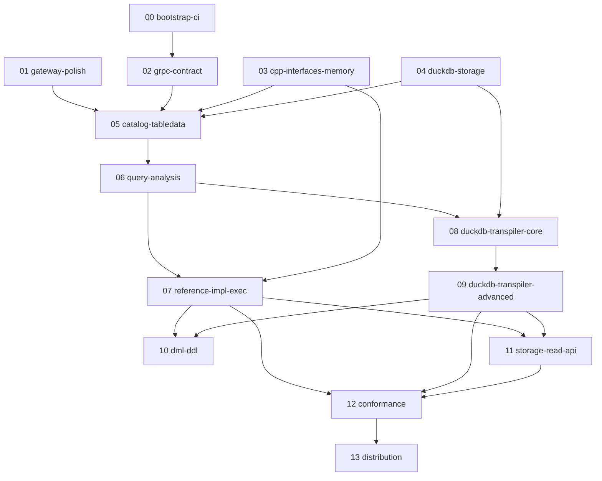

# BigQuery emulator — roadmap plan index

This index sequences the work in [ROADMAP.md](../../ROADMAP.md) into 14 sub-plans under `.cursor/plans/`. Each sub-plan is sized for **one subagent invocation** with minimal context: read the plan file, the linked docs, and the files named in the plan — not the whole repo.

## Already landed (do not re-do)

- Phase 0 scaffold: `gateway_main`, `emulator_main` stubs, route table, `proto/emulator.proto` v0 sketch, Taskfile/Makefile/CMake
- Phase 1 route wiring: all BigQuery v2 REST endpoints registered as 501 stubs ([docs/REST_API.md](../../docs/REST_API.md))
- Pluggable architecture documented in ROADMAP (Reference Impl + DuckDB engines; In-Memory + DuckDB storage)

## Plan catalog

| # | Plan file | ROADMAP phase | Est. scope |
|---|-----------|---------------|------------|
| 00 | [bootstrap-ci-docker_e0f1a2b3.plan.md](bootstrap-ci-docker_e0f1a2b3.plan.md) | Phase 0 (remainder) | S |
| 01 | [gateway-polish_c4d5e6f7.plan.md](gateway-polish_c4d5e6f7.plan.md) | Phase 1 (remainder) | S |
| 02 | [grpc-contract-go-cpp_8a9b0c1d.plan.md](grpc-contract-go-cpp_8a9b0c1d.plan.md) | Phase 2 | M |
| 03 | [cpp-interfaces-memory-storage_2e3f4a5b.plan.md](cpp-interfaces-memory-storage_2e3f4a5b.plan.md) | Phase 3 (part 1) | M |
| 04 | [duckdb-persistent-storage_6c7d8e9f.plan.md](duckdb-persistent-storage_6c7d8e9f.plan.md) | Phase 3 (part 2) | L |
| 05 | [catalog-grpc-tabledata-e2e_1a2b3c4d.plan.md](catalog-grpc-tabledata-e2e_1a2b3c4d.plan.md) | Phase 3 (part 3) | M |
| 06 | [query-analysis-dryrun_5e6f7a8b.plan.md](query-analysis-dryrun_5e6f7a8b.plan.md) | Phase 4 | M |
| 07 | [reference-impl-execution_9c0d1e2f.plan.md](reference-impl-execution_9c0d1e2f.plan.md) | Phase 5.A | L |
| 08 | [duckdb-transpiler-core_3a4b5c6d.plan.md](duckdb-transpiler-core_3a4b5c6d.plan.md) | Phase 5.B (part 1) | L |
| 09 | [duckdb-transpiler-advanced_7e8f9a0b.plan.md](duckdb-transpiler-advanced_7e8f9a0b.plan.md) | Phase 5.B (part 2) | L |
| 10 | [dml-ddl-statements_b1c2d3e4.plan.md](dml-ddl-statements_b1c2d3e4.plan.md) | Phase 6 | M |
| 11 | [storage-read-api_f5a6b7c8.plan.md](storage-read-api_f5a6b7c8.plan.md) | Phase 7 | M |
| 12 | [conformance-harness_d9e0f1a2.plan.md](conformance-harness_d9e0f1a2.plan.md) | Phase 8 | M |
| 13 | [distribution-release_4b5c6d7e.plan.md](distribution-release_4b5c6d7e.plan.md) | Phase 9 | S |

S = small (~1 session), M = medium (~1–2 sessions), L = large (~2–3 sessions)

## Dependency graph



## Recommended sequencing

**Wave 1 (parallel):** 00, 01 — no engine dependency.

**Wave 2:** 02 — needs 00 for CI to validate codegen.

**Wave 3 (parallel):** 03, 04 — both need 02 for proto types; independent of each other.

**Wave 4:** 05 — needs 01 (REST handlers), 02 (gRPC), 03 (memory storage minimum).

**Wave 5:** 06 — needs 05 (catalog with tables to analyze against).

**Wave 6 (parallel):** 07, 08 — both need 06; 07 uses memory storage, 08 needs 04 for DuckDB path.

**Wave 7:** 09 — needs 08.

**Wave 8:** 10 — needs 07 (DML via reference impl at minimum).

**Wave 9:** 11 — needs 07 or 09 for result sources.

**Wave 10:** 12 — needs 07 + 11 for full client-library coverage.

**Wave 11:** 13 — needs 12 green.

## Subagent invocation template

```
Read and execute .cursor/plans/<plan-file>.plan.md for bigquery-emulator.

Constraints:
- Follow ROADMAP.md non-goals (no Go port of GoogleSQL).
- Cross-check REST shapes against docs/REST_API.md and docs/bigquery/docs/reference/rest/v2/.
- Commit after each logical unit per CLAUDE.md auto-commit rules.
- Mark plan todos completed as you finish them.
- Run verification commands listed in the plan before declaring done.
```

## Non-goals (all plans)

- No Go port of GoogleSQL analyzer/executor.
- No BigQuery ML, Omni, or external data sources.
- No production SLA / performance guarantees.
- Persistence is opt-in via `--storage=duckdb`; default is volatile in-memory.
