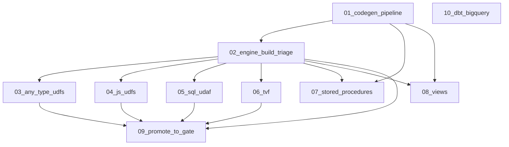

# bigquery-utils conformance — subagent dispatch index

This index replaces the monolithic plan at `~/.cursor/plans/bigquery-utils_conformance_fixtures_7fefe718.plan.md`. Each linked plan is **self-contained**: scope, files, verification, dependencies, and out-of-scope boundaries. Run them in number order; later plans depend on earlier ones unless noted.

## Background (shared by all sub-plans)

Reuse [GoogleCloudPlatform/bigquery-utils](https://github.com/GoogleCloudPlatform/bigquery-utils) (Apache-2.0) battle-tested SQL as real-world coverage for this emulator. Upstream's Dataform UDF test format maps cleanly onto this repo's YAML conformance lane (`conformance/cmd/runner`, profile `duckdb`, fresh `emulator_main` per fixture):

- UDF body: `udfs/**/<name>.sqlx` -> `CREATE OR REPLACE FUNCTION ${self()}(...) AS ( <sql> );`
- Test cases: sibling `test_cases.js` -> `unit_test_utils.generate_udf_test("name", [{ inputs:[...], expected_output:... }])`.

Conformance fixture schema (verified in `conformance/runner/fixture.go`): single-doc YAML with `name`/`query`/`expected`, optional `setup` (`dataset`/`table`/`rows`/`sql` steps), `profiles` (default `[duckdb]`). Expected `rows` are column-name maps; comparison is typed; `match` is `ordered`/`unordered`/`schema_only`.

Local clones available: `/home/brighten-tompkins/Code/bigquery-utils` and `/home/brighten-tompkins/Code/dbt-adapters`.

## Engine UDF support baseline (verified)

| UDF flavor | Engine today | Plan that needs/enables it |
|------------|--------------|----------------------------|
| Pure-SQL scalar `fn(x T) AS (expr)` | Works (engine + gateway e2e tests) | 01, 02 |
| `ANY TYPE` templated scalar | Code path exists, untested | 03 |
| `LANGUAGE js` | Not runnable | 04 |
| SQL aggregate (UDAF) | Call-time unsupported | 05 |
| TVF (`CREATE TABLE FUNCTION`) | `UNIMPLEMENTED` | 06 |

## Sub-plans (run in order)

| # | Plan file | In/Out of original scope | Depends on |
|---|-----------|--------------------------|------------|
| 01 | [bqutils-01-codegen-pipeline.plan.md](bqutils-01-codegen-pipeline.plan.md) | In scope | — |
| 02 | [bqutils-02-engine-build-triage.plan.md](bqutils-02-engine-build-triage.plan.md) | In scope | 01 |
| 03 | [bqutils-03-any-type-udfs.plan.md](bqutils-03-any-type-udfs.plan.md) | Out of scope (engine) | 02 |
| 04 | [bqutils-04-js-udfs.plan.md](bqutils-04-js-udfs.plan.md) | Out of scope (engine) | 02 |
| 05 | [bqutils-05-sql-udaf.plan.md](bqutils-05-sql-udaf.plan.md) | Out of scope (engine) | 02 |
| 06 | [bqutils-06-tvf.plan.md](bqutils-06-tvf.plan.md) | Out of scope (engine) | 02 |
| 07 | [bqutils-07-stored-procedures.plan.md](bqutils-07-stored-procedures.plan.md) | Out of scope (corpus) | 01, 02 |
| 08 | [bqutils-08-views.plan.md](bqutils-08-views.plan.md) | Out of scope (corpus) | 01, 02 |
| 09 | [bqutils-09-promote-to-gate.plan.md](bqutils-09-promote-to-gate.plan.md) | Out of scope (gating) | 02 (+ any of 03–06) |
| 10 | [bqutils-10-dbt-bigquery.plan.md](bqutils-10-dbt-bigquery.plan.md) | Out of scope (deferred repo) | independent |

## Subagent dispatch

How to spin off subagents to execute these plans (waves, parallel-vs-serial, the bazel single-invocation constraint, per-subagent prompts, parent cleanup): see [bqutils-dispatch.plan.md](bqutils-dispatch.plan.md).

## Status tracker

Updated by the parent agent after each subagent returns.

| Plan | State | Passing delta | Notes |
|------|-------|---------------|-------|
| 01 codegen-pipeline | done | — | 110 emitted, 97 skipped @ upstream 0754ad8 |
| 02 engine-build-triage | done | 36/110 | build skipped; 36 passing / 74 known_failing |
| 03 any-type-udfs | done | 36→39+ | floor/ceil semantic, CAST fixes, null-safe comparator; 3 udf fixtures |
| 04 js-udfs | done | — | Option B: CREATE LANGUAGE js → 501; error fixture |
| 05 sql-udaf | done | 39→55 | EvalSqlUdafBody; scaled_sum/average in passing/ |
| 06 tvf | done (deferred) | — | 0 CREATE TABLE FUNCTION in bigquery-utils @ 0754ad8 |
| 07 stored-procedures | done | +4 | `passing/stored_procedures/`: get_next_ids, linear_regression, bh_multiple_tests, chi_square (simplified bodies where noted) |
| 08 views | done | — | `passing/views/migration/teradata/sys_calendar.yaml` |
| 09 promote-to-gate | done | 67 | CI job `bqutils` in conformance.yml; pin + docs; fixtests-08 ANY TYPE +6 |
| 10 dbt-bigquery | done (early phases) | n/a | scaffold + sync + task; pytest triage deferred |

## Dependency graph



**Sequential default:** 01 -> 02 -> 03 -> 04 -> 05 -> 06 -> 07 -> 08 -> 09, with 10 runnable any time (separate repo, large).

**Parallel lanes after 02 (if running concurrently):**
- Lane A (engine features that re-promote `known_failing` fixtures): 03, 04, 05, 06 independent of each other.
- Lane B (corpus expansion): 07, 08 independent.
- Convergence: 09 promotes the stable union into the gate after the relevant feature plans land.

## Per-subagent instructions

1. Read **only** your assigned plan file plus this index's Background + Engine-baseline sections.
2. Do **not** start a plan until its prerequisites (column above) are merged, or note explicit stubs.
3. After any engine feature plan (03–06), re-run `task conformance:bqutils-sync` then re-triage so newly-passing fixtures migrate from `known_failing/` to `passing/`.
4. Heavy C++/bazel builds: follow [`.cursor/rules/bazel-process-hygiene.mdc`](../rules/bazel-process-hygiene.mdc) and [`.cursor/rules/process-hygiene.mdc`](../rules/process-hygiene.mdc) (single invocation, throttled jobs, `task bazel:status`/`bazel:shutdown` after).
5. Update `docs/REST_API.md` / `ROADMAP.md` / `docs/ENGINE_POLICY.md` / `third_party/README.md` **within each plan** as surfaces land.

### GoogleSQL prebuilt — do not misdiagnose (required for any plan that builds the engine)

`task emulator:build-engine:bazel` defaults to **`GOOGLESQL_SOURCE=prebuilt`**, which reads `.cache/googlesql-prebuilt/googlesql_prebuilt_linux_amd64/` (gitignored; **not shipped with the repo**). See [`docs/dev/googlesql-prebuilt/troubleshooting.md`](../../docs/dev/googlesql-prebuilt/troubleshooting.md).

**Before claiming "prebuilt artifact is broken", run `task googlesql:status` and classify:**

| Symptom | Meaning | Fix (pick one) |
|---------|---------|----------------|
| Preflight: **"cache is empty"** / no `MODULE.bazel` under the cache dir | **Environment not set up** — not a broken release tarball | `task googlesql:fetch-prebuilt URL=... SHA256=...` (pins in `.github/workflows/release.yml` `RELEASE_GOOGLESQL_PREBUILT_*`), or `GOOGLESQL_SOURCE=local task emulator:build-engine:bazel` if `../googlesql/` exists |
| `validate_artifact.py` prints **`FAIL_*`** with cache present | **Bad/corrupt pin or artifact** | `task googlesql:clean && task googlesql:fetch-prebuilt ...` or repin; do not blame "broken prebuilt" without a `FAIL_*` token |
| Bazel compile/link error **after** preflight passes | **Engine/repo issue** or ABI drift — separate from empty cache | Read the actual bazel error; see troubleshooting "linker errors" |

**Wrong diagnostic (ignore):** missing paths like `googlesql/public/functions` under the prebuilt cache. Prebuilt layout is `MODULE.bazel`, `manifest.json`, `include/googlesql/...`, `lib/...` — not a full source tree ([`repo-layout.md`](../../docs/dev/googlesql-prebuilt/repo-layout.md)).

**Triage-only shortcut:** if `./bin/emulator_main` already exists and runs, plan 02 **does not require** a rebuild unless engine sources changed. Use the existing binary for `conformance/cmd/runner` and note in the return whether a build was skipped.

## Verification (whole effort)

```bash
task conformance:bqutils-sync     # regenerate fixtures from the local/upstream clone
task conformance:bqutils          # run the passing set (non-gating lane)
```

Target: a growing `passing/` set as engine feature plans (03–06) land, with `known_failing/` shrinking and an accurate skip report at codegen time.
