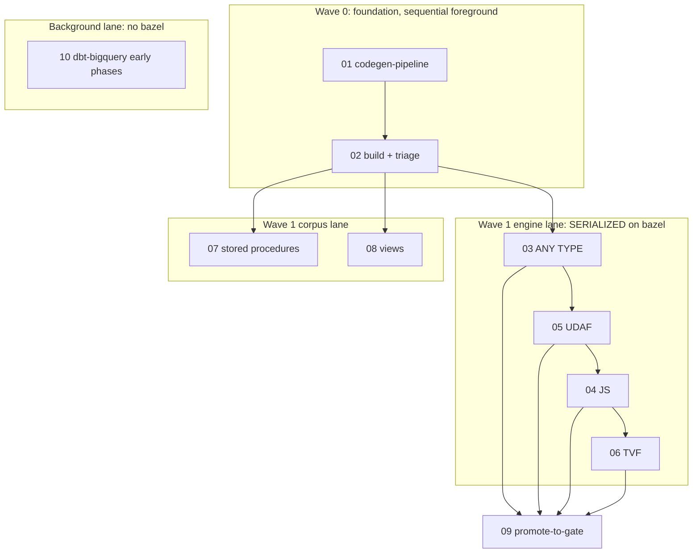

# BQUtils — Subagent dispatch / orchestration

Execution playbook for [bqutils-00-index](bqutils-00-index.plan.md). This file says **who runs, in what order, in parallel or not, with what prompt, and what the parent does between runs**. It does not change the sub-plans themselves.

## The two constraints (read first)

1. **Dependency graph** (from the index): `01 -> 02 -> {03,04,05,06,07,08,09}`; `03,04,05,06 -> 09`; `10` independent.
2. **Bazel single-invocation invariant** (`.cursor/rules/bazel-process-hygiene.mdc` + `process-hygiene.mdc`): **only one `bazel build` per workspace at a time.** A GoogleSQL-linked engine build holds a multi-GB JVM daemon and forks ~14 clang processes. Two concurrent engine builds (even in separate worktrees) will OOM the box.

> **Consequence:** every plan that *modifies the C++ engine* (03, 04, 05, 06, and possibly 07/08 if they need engine fixes) must be **serialized** at the build step, even though the dependency graph marks 03-06 as logically parallel. Do **not** fan these out concurrently. The only safe concurrency is between **non-bazel** work (01 codegen, 10 early phases) and at most one engine build.

## Subagent type & mode

- Use `subagent_type: generalPurpose` for all 01-10 (multi-step implementation; not readonly).
- `run_in_background`: `false` (foreground) for engine-build plans so the parent can serialize and clean up deterministically. `true` only for the independent non-bazel lane (10 early phases, 01 if desired).
- Optional isolation: `best-of-n-runner` (git worktree) is acceptable for a single engine plan to keep the main tree clean, but **never** spin up two worktrees that both build the engine — same OOM hazard.

## Dispatch waves



### Wave 0 — Foundation (sequential, foreground, blocking everything)

| Order | Plan | Bazel? | run_in_background | Why |
|-------|------|--------|-------------------|-----|
| 1 | [01](bqutils-01-codegen-pipeline.plan.md) | No (Go/Node) | optional | Produces extractor + generator + sync + task. No engine build. |
| 2 | [02](bqutils-02-engine-build-triage.plan.md) | **Yes (first build)** | false | Builds `bin/emulator_main`, generates, triages passing/known_failing baseline. |

01 and 02 are strictly sequential (02 needs the pipeline 01 produces). Do not start any other engine plan until 02's baseline exists.

### Wave 1 — engine lane (one subagent at a time, bazel-serialized)

Dispatch in value order; **finish and clean up one before starting the next.** Each plan already includes a "re-sync + re-triage" step so newly-passing bigquery-utils fixtures migrate `known_failing/ -> passing/`.

| Order | Plan | Note |
|-------|------|------|
| 1 | [03 ANY TYPE](bqutils-03-any-type-udfs.plan.md) | Biggest mover (nullifzero/nvl and many community UDFs). |
| 2 | [05 SQL UDAF](bqutils-05-sql-udaf.plan.md) | New aggregate eval path. |
| 3 | [04 JS UDFs](bqutils-04-js-udfs.plan.md) | Start with Option B (clean UNIMPLEMENTED) unless Option A explicitly funded. |
| 4 | [06 TVF](bqutils-06-tvf.plan.md) | Scope-check first; may be a near no-op for bigquery-utils. |

### Wave 1 — corpus lane (07, 08)

Fixture authoring + engine-check. If a plan needs **no** engine change, it only needs the already-built `bin/emulator_main` and can run in a bazel-quiet window (even concurrently with non-bazel work). If it needs an engine fix, it joins the serialized engine lane. Default: run [07](bqutils-07-stored-procedures.plan.md) then [08](bqutils-08-views.plan.md) after the engine lane, or interleave when no build is active.

### Background lane — 10 (independent repo, no bazel)

[10 dbt-bigquery](bqutils-10-dbt-bigquery.plan.md) is a separate repo and uses Python/nox, not bazel. Dispatch its early phases (`feasibility` prototype, `scaffold`, `sync-script`, `conftest-wiring`, `task-wiring`) with `run_in_background: true` concurrently with Waves 0-1. **Gate** its final `triage` step (needs `task emulator:run-full`) to a window when no bazel build is running, to avoid memory contention.

### Wave 2 — gate promotion (last)

[09 promote-to-gate](bqutils-09-promote-to-gate.plan.md) runs after 02 and whichever of 03-06 have landed (it gates only what already passes; more features just means a bigger `passing/` set).

## Parent responsibilities BETWEEN every subagent

The parent agent owns cleanup regardless of what the subagent did (`process-hygiene.mdc`, "Subagent boundary"):

```bash
# 1. Bazel server + clients + clang
task bazel:shutdown
task bazel:kill-strays
task bazel:status            # expect (clean)

# 2. Emulator / gateway / runner strays
pgrep -af 'emulator_main|gateway_main|bigquery-emulator|conformance/cmd/runner' \
  | grep -vE 'grep|/usr/bin/zsh' || echo '(clean)'

# 3. Headroom check before the next heavy subagent
free -h | head -2           # need > 4 GiB available before spawning the next engine plan
```

Then: re-read the returned subagent's final terminal state (don't trust "I cleaned up"), update the [bqutils-00 status table](bqutils-00-index.plan.md), and if an engine feature landed, confirm the re-triage moved fixtures into `passing/`.

## Per-subagent prompt template

Give each subagent a self-contained prompt (subagents don't see this chat):

```
Read ONLY these files and follow them:
- .cursor/plans/bqutils-<NN>-<slug>.plan.md   (your assigned plan)
- .cursor/plans/bqutils-00-index.plan.md       (Background + Engine-baseline sections only)

Context: bigquery-emulator repo. Your prerequisites (<list>) are already merged:
<one-line state: e.g. "bin/emulator_main is built; conformance/thirdparty-fixtures/bigquery_utils/{passing,known_failing} exist">.

Do the work in your plan's todos, in order. Rules:
- Follow .cursor/rules/bazel-process-hygiene.mdc and process-hygiene.mdc for ANY
  bazel/engine build: single invocation, throttled jobs, `task bazel:status` +
  `task bazel:shutdown` when done. Never start a second bazel build.
- Update docs within your plan (REST_API/ENGINE_POLICY/ROADMAP/third_party/README) as surfaces land.
- Commit per .cursor/rules/auto-commit.mdc (run the pre-commit lint gate).
Return: which todos you completed, fixture pass/fail counts (ran/passed/known_failing/
skipped-at-codegen), any engine gaps you could not close, and the final `task bazel:status`.
```

## Progress tracking

Maintain the status table in [bqutils-00-index](bqutils-00-index.plan.md) (add it if absent):

| Plan | State | Passing delta | Notes |
|------|-------|---------------|-------|
| 01 | pending | — | |
| 02 | pending | baseline | |
| 03 | pending | | |
| ... | | | |

Update after each subagent returns, alongside flipping the relevant `todos` status in this dispatch plan.

## Anti-patterns to avoid

- Fanning out 03/04/05/06 as concurrent subagents (concurrent bazel builds -> OOM).
- Running 10's `emulator:run-full` triage while an engine build is in flight.
- Skipping the parent cleanup block between subagents (strays compound and OOM the box).
- Letting a subagent start before its prerequisite plan's output exists (e.g. 03 before 02's baseline).
