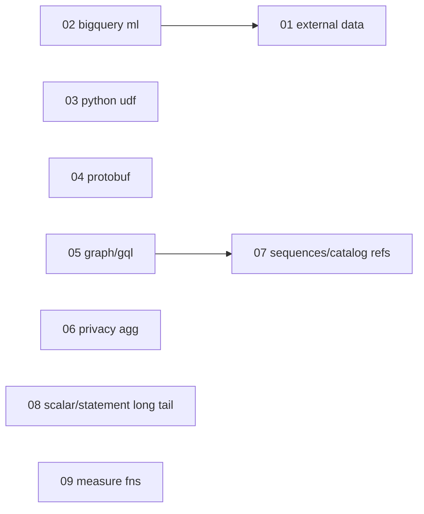

# Expand — third-wave feature dispatch index

This is the successor to [full-00-index.plan.md](full-00-index.plan.md).
The parity 01-13 and full 01-11 sets landed the common query / DML /
scripting / UDF / storage-API surface and indexed the remaining gaps.
This set closes the `unsupported` / deferred `local_stub` families that
[ROADMAP.md §Planned work](../../ROADMAP.md) now tracks as ⏳ planned —
the rows that still surface `UNIMPLEMENTED` (or **501** at the gateway)
today.

Source documents (re-read before starting any sub-plan; they are the
authoritative trackers and must be updated in the same commits that land
implementations):

- [`ROADMAP.md`](../../ROADMAP.md) §Planned work — the ⏳ index this set drains
- [`docs/ENGINE_POLICY.md`](../../docs/ENGINE_POLICY.md) §Unsupported families — per-family posture to flip
- [`backend/engine/duckdb/transpiler/node_dispositions.yaml`](../../backend/engine/duckdb/transpiler/node_dispositions.yaml) — per-node route dispositions (`unsupported` rows)
- [`backend/engine/duckdb/transpiler/functions.yaml`](../../backend/engine/duckdb/transpiler/functions.yaml) — per-function route dispositions (`unsupported` rows)
- [`backend/engine/duckdb/transpiler/SHAPE_TRACKER.md`](../../backend/engine/duckdb/transpiler/SHAPE_TRACKER.md) — human-readable mirror of the YAML registries

Repo-wide invariants every sub-plan obeys (identical to the parity / full sets):

1. **Promotion policy** (SHAPE_TRACKER §Promotion policy): landing a shape
   requires (a) the `Emit*` / semantic-executor / control-op / catalog
   handler and (b) conformance fixtures that exercise it, in the same change.
2. **Tracker parity**: edit `node_dispositions.yaml` / `functions.yaml`
   and the matching SHAPE_TRACKER.md row in the same commit;
   `task lint:dispositions` (wired into `task lint:run`) gates drift.
3. **No silent approximation**: a shape either lands on its route with
   exact BigQuery semantics or keeps surfacing `UNIMPLEMENTED`. A
   deterministic `local_stub` is allowed only for client-library probes
   (per ENGINE_POLICY), never as a fake answer downstream. The one
   sanctioned exception to "no cloud" is **opt-in live external data
   sources** (plan 01), which the user explicitly requested.
4. **Bazel hygiene**: one bazel invocation at a time, throttled via
   `task emulator:build-engine:bazel` / `task bazel:test`; end every
   plan with `task bazel:shutdown` + `task bazel:status` -> `(clean)`.

## Sub-plans (most impactful for real workloads → least)

| # | Plan file | Theme | ENGINE_POLICY family / ROADMAP row |
|---|-----------|-------|------------------------------------|
| 01 | [expand-01-external-data-sources.plan.md](expand-01-external-data-sources.plan.md) | `gs://` LOAD/EXPORT, Google Sheets, connections / `EXTERNAL_QUERY`, ephemeral `tableDefinitions`; per-source **fixture vs live** config | External data sources |
| 02 | [expand-02-bigquery-ml.plan.md](expand-02-bigquery-ml.plan.md) | `CREATE MODEL` materialization (promote off `local_stub`) + `ML.PREDICT` / `ML.FORECAST` / `ML.EVALUATE` | BigQuery ML |
| 03 | [expand-03-python-udf-runtime.plan.md](expand-03-python-udf-runtime.plan.md) | `CREATE FUNCTION ... LANGUAGE python` register / persist / evaluate | Python UDFs |
| 04 | [expand-04-protobuf-shapes.plan.md](expand-04-protobuf-shapes.plan.md) | Proto type surface — `ResolvedMakeProto`, `Get/ReplaceProtoField`, `GetProtoOneof`, `GetRowField`, `FilterField(Arg)` | Protobuf field access |
| 05 | [expand-05-graph-gql.plan.md](expand-05-graph-gql.plan.md) | `GRAPH_TABLE` / GQL — the nine `ResolvedGraph*Scan` classes + `ResolvedCatalogColumnRef` | Graph / GQL scans |
| 06 | [expand-06-privacy-aggregates.plan.md](expand-06-privacy-aggregates.plan.md) | `ResolvedAnonymizedAggregateScan` / `ResolvedDifferentialPrivacyAggregateScan` / `ResolvedAggregationThresholdAggregateScan` | Privacy-preserving aggregates |
| 07 | [expand-07-sequences-catalog-refs.plan.md](expand-07-sequences-catalog-refs.plan.md) | `ResolvedSequence` / `NEXT VALUE FOR`, `ResolvedExpressionColumn`, `ResolvedCatalogColumnRef` (non-graph) | Catalog / sequence helpers |
| 08 | [expand-08-scalar-statement-long-tail.plan.md](expand-08-scalar-statement-long-tail.plan.md) | `KEYS.ENCRYPT` / `KEYS.DECRYPT_BYTES`, `ST_GEOGFROMWKB`, `SESSION_USER`, `ResolvedExplainStmt` | Deferred functions + EXPLAIN |
| 09 | [expand-09-measure-functions.plan.md](expand-09-measure-functions.plan.md) | MEASURE types + `AGGREGATE(<measure>)` | Measure functions |

## Dependency sketch

- **02 (BigQuery ML)** benefits from **01**'s opt-in live-source plumbing
  if it ever fetches remote models, but its core (local model
  registration + inference over local data) is independent.
- **05 (Graph)** needs `ResolvedCatalogColumnRef`, which **07** owns the
  disposition for; land 07's catalog-ref handling first or co-develop.
- Everything else is logically independent and can be picked up in any
  order. 03, 04, 06, 08, 09 each touch a disjoint slice of the engine.

## Dispatch (serialized engine lane)

See [expand-dispatch.plan.md](expand-dispatch.plan.md) for the session
protocol, subagent prompt, and process/bazel hygiene constraints.

**Every plan modifies the C++ engine** (and 01 also the Go gateway) and
must rebuild + re-run conformance, so plans stay serialized end-to-end:

- `subagent_type: generalPurpose`, `run_in_background: false`.
- Run the parent cleanup block from `process-hygiene.mdc` between every
  subagent; confirm the prior plan's work is committed and
  `task lint:dispositions` is green on main before dispatching the next.

## Verification matrix (run after each plan)

| Check | Command | Bar |
|-------|---------|-----|
| Engine build | `task emulator:build-engine:bazel` | exit 0 |
| First-party conformance | `task conformance:run` | no regressions; new fixtures pass |
| Disposition parity | `task lint:dispositions` | green |
| Lint gate | `task lint:fix && task lint:run` | green |
| Routing matrix | `task conformance:routing-matrix` | new shapes report intended route |
| Third-party (targeted) | `task thirdparty:<suite>` | per-plan; skip-matrix rows removed as shapes land |
| Bazel hygiene | `task bazel:shutdown && task bazel:status` | `(clean)` |

## Status (updated by the parent agent after each subagent returns)

| Plan | State | Conformance delta | Commits | Notes |
|------|-------|-------------------|---------|-------|
| 01 | pending | — | | External data sources (fixture + opt-in live) |
| 02 | pending | — | | BigQuery ML (CREATE MODEL + inference) |
| 03 | pending | — | | Python UDF runtime |
| 04 | pending | — | | Protobuf field access |
| 05 | pending | — | | Graph / GQL scans |
| 06 | pending | — | | Privacy-preserving aggregates |
| 07 | pending | — | | Sequences + catalog refs |
| 08 | pending | — | | KEYS encrypt/decrypt, ST_GEOGFROMWKB, SESSION_USER, EXPLAIN |
| 09 | pending | — | | Measure functions |

## Bookkeeping per landed plan

- Drop `unsupported` / `status=planned` markers from `functions.yaml`,
  `node_dispositions.yaml`, and SHAPE_TRACKER.md rows that landed.
- Update the matching ROADMAP.md §Planned work bullet (⏳ -> ✅, or move
  the row to a landed section) and the ENGINE_POLICY.md family table
  posture (`unsupported` -> `local_impl` / `local_stub`, etc.).
- Remove third-party skip-matrix rows (`third_party/*/emulator_*skip*`,
  `third_party/README.md`) the landed shape unblocks; re-run that suite
  to prove it.
