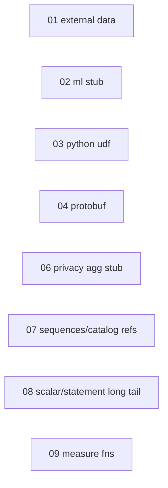

# Expand — third-wave feature dispatch index

This is the successor to [full-00-index.plan.md](full-00-index.plan.md).
The parity 01-13 and full 01-11 sets landed the common query / DML /
scripting / UDF / storage-API surface and indexed the remaining gaps.
This set drains the families that [ROADMAP.md §Planned work](../../ROADMAP.md)
now tracks as ⏳ planned — the rows that still surface `UNIMPLEMENTED`
(or **501** at the gateway) today.

Two kinds of work live here, and each plan says which it is:

- **Real implementation** — the feature is genuinely useful locally, so
  land exact BigQuery semantics + conformance fixtures.
- **Deterministic stub** — the feature is not useful in a local emulator
  (no Vertex AI, no real keysets, no production DP), so the only goal is
  that a query referencing it **does not fail**: return a schema-correct
  BigQuery-shaped placeholder via the `local_stub` lane.

**Graph / GQL is not in this set.** `GRAPH_TABLE` / GQL is effectively a
whole second query language; it stays `unsupported` and is **not**
planned (see [ROADMAP.md §Non-goals](../../ROADMAP.md)).

Source documents (re-read before starting any sub-plan; they are the
authoritative trackers and must be updated in the same commits that land
implementations):

- [`ROADMAP.md`](../../ROADMAP.md) §Planned work — the ⏳ index this set drains
- [`docs/ENGINE_POLICY.md`](../../docs/ENGINE_POLICY.md) §Unsupported families — per-family posture to flip
- [`backend/engine/duckdb/transpiler/node_dispositions.yaml`](../../backend/engine/duckdb/transpiler/node_dispositions.yaml) — per-node route dispositions (`unsupported` rows)
- [`backend/engine/duckdb/transpiler/functions.yaml`](../../backend/engine/duckdb/transpiler/functions.yaml) — per-function route dispositions (`unsupported` rows)
- [`backend/engine/duckdb/transpiler/SHAPE_TRACKER.md`](../../backend/engine/duckdb/transpiler/SHAPE_TRACKER.md) — human-readable mirror of the YAML registries

Repo-wide invariants every sub-plan obeys (identical to the parity / full sets):

1. **Promotion policy** (SHAPE_TRACKER §Promotion policy): landing a shape
   requires (a) the `Emit*` / semantic-executor / control-op / catalog
   handler and (b) conformance fixtures that exercise it, in the same change.
2. **Tracker parity**: edit `node_dispositions.yaml` / `functions.yaml`
   and the matching SHAPE_TRACKER.md row in the same commit;
   `task lint:dispositions` (wired into `task lint:run`) gates drift.
3. **Real vs stub is a deliberate per-family call**: a real-impl plan
   lands exact BigQuery semantics; a stub plan returns a schema-correct
   placeholder via `local_stub` so the query does not fail. The stub
   families here (ML, DP aggregates, `KEYS.ENCRYPT`/`DECRYPT_BYTES`,
   `SESSION_USER`) deliberately relax the older ENGINE_POLICY "fail
   loudly downstream" stance — the product decision is no-fail, not
   loud-fail, so update the policy text alongside. The one sanctioned
   exception to "no cloud" is **opt-in live external data sources**
   (plan 01), which the user explicitly requested.
4. **Bazel hygiene**: one bazel invocation at a time, throttled via
   `task emulator:build-engine:bazel` / `task bazel:test`; end every
   plan with `task bazel:shutdown` + `task bazel:status` -> `(clean)`.

## Sub-plans (most impactful for real workloads → least)

`kind` is **real** (land BigQuery semantics) or **stub** (no-fail placeholder).

| # | Plan file | Kind | Theme | ROADMAP row |
|---|-----------|------|-------|-------------|
| 01 | [expand-01-external-data-sources.plan.md](expand-01-external-data-sources.plan.md) | real | `gs://` LOAD/EXPORT, Google Sheets, connections / `EXTERNAL_QUERY`, ephemeral `tableDefinitions`; per-source **fixture vs live** config | External data sources |
| 02 | [expand-02-bigquery-ml.plan.md](expand-02-bigquery-ml.plan.md) | **stub** | `ML.PREDICT` / `ML.FORECAST` / `ML.EVALUATE` return schema-correct placeholders; `CREATE MODEL` stays `local_stub` | BigQuery ML |
| 03 | [expand-03-python-udf-runtime.plan.md](expand-03-python-udf-runtime.plan.md) | real | `CREATE FUNCTION ... LANGUAGE python` register / persist / evaluate | Python UDFs |
| 04 | [expand-04-protobuf-shapes.plan.md](expand-04-protobuf-shapes.plan.md) | real | Proto type surface — `ResolvedMakeProto`, `Get/ReplaceProtoField`, `GetProtoOneof`, `GetRowField`, `FilterField(Arg)` | Protobuf field access |
| 06 | [expand-06-privacy-aggregates.plan.md](expand-06-privacy-aggregates.plan.md) | **stub** | `ResolvedAnonymizedAggregateScan` / `ResolvedDifferentialPrivacyAggregateScan` / `ResolvedAggregationThresholdAggregateScan` — strip privacy modifiers, return the plain aggregate | Privacy-preserving aggregates |
| 07 | [expand-07-sequences-catalog-refs.plan.md](expand-07-sequences-catalog-refs.plan.md) | real | `ResolvedSequence` / `NEXT VALUE FOR`, `ResolvedExpressionColumn`, `ResolvedCatalogColumnRef` (non-graph) | Catalog / sequence helpers |
| 08 | [expand-08-scalar-statement-long-tail.plan.md](expand-08-scalar-statement-long-tail.plan.md) | mixed | **real:** `ST_GEOGFROMWKB`, `ResolvedExplainStmt`; **stub:** `KEYS.ENCRYPT` / `KEYS.DECRYPT_BYTES`, `SESSION_USER` | Deferred functions + EXPLAIN |
| 09 | [expand-09-measure-functions.plan.md](expand-09-measure-functions.plan.md) | real | MEASURE types + `AGGREGATE(<measure>)` | Measure functions |

> **05 (Graph / GQL) was removed.** `GRAPH_TABLE` / GQL is effectively a
> second query language; it stays `unsupported` and is **not** planned.
> The plan slot is intentionally left empty (no `expand-05-*`).

## Dependency sketch

- Every plan is logically independent and can be picked up in any order;
  the lane is serialized only because they all rebuild the engine.
- The stub plans (02, 06, and the stub half of 08) are the cheapest —
  they reuse the existing `local_stub` lane and just need a placeholder
  + a no-fail fixture, so they make good warm-up or fill-in work.

## Dispatch (serialized engine lane)

- **Live runbook:** [expand-dispatch.plan.md](expand-dispatch.plan.md) — **start here**; wave `todos` in the frontmatter drive execution order.
- Constraints (bazel single-invocation, hot files, process hygiene) are documented in expand-dispatch (the `expand-*` analog of [parity-dispatch.plan.md](parity-dispatch.plan.md)).

## Verification matrix (run after each plan)

| Check | Command | Bar |
|-------|---------|-----|
| Engine build | `task emulator:build-engine:bazel` | exit 0 |
| First-party conformance | `task conformance:run` | no regressions; new fixtures pass |
| Disposition parity | `task lint:dispositions` | green |
| Lint gate | `task lint:fix && task lint:run` | green |
| Routing matrix | `task conformance:routing-matrix` | new shapes report intended route |
| Third-party (targeted) | `task thirdparty:<suite>` | per-plan; skip-matrix rows removed as shapes land |
| Bazel hygiene | `task bazel:shutdown && task bazel:status` | `(clean)` |

## Status (updated by the parent agent after each subagent returns)

| Plan | Kind | State | Conformance delta | Commits | Notes |
|------|------|-------|-------------------|---------|-------|
| 01 | real | landed (partial) | +1 external (google_sheets_class_data); gs:// engine path | e48222e, 6c112c1, 42a2f61 | Sheets + gs:// LOAD/EXPORT + config model; EXTERNAL_QUERY federated reads deferred |
| 02 | stub | landed | +3 specialized (ml_predict/evaluate/forecast_stub) | 67e9d30, 8ad84ed | ML.* local_stub TVFs; CREATE MODEL stays control stub |
| 03 | real | landed | +1 udf (python_scalar_add); cw_xml_extract → bqutils passing | 80fb50a, 9e0e1cc, feb104b | Subprocess python3 scalar UDFs; lxml for cw_xml_extract |
| 04 | real | landed | +1 specialized (replace_fields_struct); +7 unit tests | cc1a169, c6c7378 | Proto AST on semantic executor; catalog descriptor pool deferred |
| 05 | — | removed | — | | Graph / GQL — unsupported, not planned |
| 06 | stub | landed | +3 specialized (anonymized/dp/threshold aggregate_stub) | 8ad84ed | Plain aggregate; NOT differential privacy |
| 07 | real | landed (partial) | +1 scripting (expression_column_set_increment) | | ExpressionColumn on semantic executor; Sequence + CatalogColumnRef sharpened (unsupported, not reachable) |
| 08 | mixed | pending | — | | real: ST_GEOGFROMWKB, EXPLAIN; stub: KEYS encrypt/decrypt, SESSION_USER |
| 09 | real | pending | — | | Measure functions |

## Bookkeeping per landed plan

- Drop `unsupported` / `status=planned` markers from `functions.yaml`,
  `node_dispositions.yaml`, and SHAPE_TRACKER.md rows that landed.
- Update the matching ROADMAP.md §Planned work bullet (⏳ -> ✅, or move
  the row to a landed section) and the ENGINE_POLICY.md family table
  posture (`unsupported` -> `local_impl` / `local_stub`, etc.).
- Audit third-party + conformance skips for the landed shape — don't just
  remove the obvious rows. Each plan carries a `skip-audit` todo naming its
  targets: client-lane matrices (`third_party/*/emulator_*skip*`,
  `third_party/README.md`, `node-bigquery-tests/EMULATOR.md`), the bqutils
  corpus (`conformance/thirdparty-fixtures/bigquery_utils/known_failing/` ->
  `passing/`), and the GoogleSQL `.test` corpus
  (`conformance/googlesql-corpus/`). Re-run the suite to prove a row now
  passes before unskipping; for stub-only families unskip only where the
  test checks the query *runs*, and leave a note for anything still blocked.
