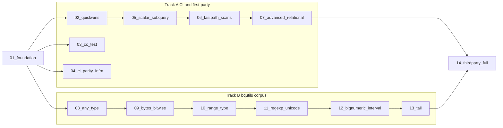

# Fix remaining test failures — subagent dispatch index

This index replaces the monolith at [fix_remaining_test_failures_26f123d3.plan.md](fix_remaining_test_failures_26f123d3.plan.md). Each linked plan is **self-contained**: scope, key files, steps, verification, dependencies, and out-of-scope boundaries. Run in number order within a track; the two tracks run in parallel.

## Failure inventory (baseline)

| Lane | Status | Scope |
|------|--------|-------|
| Go packages (`task test:run`) | Green | — |
| bqutils passing (`task conformance:bqutils`) | Green | 61/61 |
| First-party conformance (`task conformance:run`) | Red | 20/100 fail |
| CI fastpath (`task conformance:fastpath`) | Red | 5/20 fail (subset of above) |
| C++ cc_test (`task lint:cpp:test`) | CI exit 37 (Bazel internal crash) | 44 targets |
| googlesql-parity | Red | DuckDB fetch 504; source-leg conformance; compare-job artifact gating |
| Third-party | Partial CI | Java soft-gated; golang compile-only; python/node/bigframes/dbt manual |
| bqutils known_failing | Intentionally red | 56 fixtures |

Branch is ~79 commits ahead of `origin/main`; remote CI does not yet reflect bqutils 06–08 work. **Push early** (plan 01) so `build-engine` -> `ci` / `conformance` run on current code.

## Two tracks



## Sub-plans

### Track A — CI green + first-party conformance

| # | Plan file | Est. effort | Unblocks |
|---|-----------|-------------|----------|
| 01 | [fixtests-01-foundation.plan.md](fixtests-01-foundation.plan.md) | ~1 day | Push, repro, per-fixture diffs, exit-37 triage (both tracks) |
| 02 | [fixtests-02-quickwins.plan.md](fixtests-02-quickwins.plan.md) | 2–3 days | 8 fixtures -> fastpath 20/20 |
| 03 | [fixtests-03-cc-test.plan.md](fixtests-03-cc-test.plan.md) | 1–3 days | `task lint:cpp:test` exit 0 |
| 04 | [fixtests-04-ci-parity-infra.plan.md](fixtests-04-ci-parity-infra.plan.md) | 2–3 days | googlesql-parity stable; honest third-party CI signal |
| 05 | [fixtests-05-scalar-subquery.plan.md](fixtests-05-scalar-subquery.plan.md) | ~1 week | 4 scalar/subquery fixtures |
| 06 | [fixtests-06-fastpath-scans.plan.md](fixtests-06-fastpath-scans.plan.md) | ~1 week | 4 scan/struct fixtures |
| 07 | [fixtests-07-advanced-relational.plan.md](fixtests-07-advanced-relational.plan.md) | 2–3 weeks | pivot, unpivot, recursive_cte -> conformance 100/100 |

### Track B — bqutils known_failing (56 -> 0)

| # | Plan file | Est. effort | Fixtures |
|---|-----------|-------------|----------|
| 08 | [fixtests-08-bqutils-any-type.plan.md](fixtests-08-bqutils-any-type.plan.md) | 3–5 days | 6 (ANY TYPE follow-up) |
| 09 | [fixtests-09-bqutils-bytes.plan.md](fixtests-09-bqutils-bytes.plan.md) | ~1 week | 8 (bytes/bitwise/base) |
| 10 | [fixtests-10-bqutils-range.plan.md](fixtests-10-bqutils-range.plan.md) | 1–2 weeks | 6 (RANGE<> algebra) |
| 11 | [fixtests-11-bqutils-regexp.plan.md](fixtests-11-bqutils-regexp.plan.md) | 1–2 weeks | 16 (regexp/unicode/string) |
| 12 | [fixtests-12-bqutils-bignumeric.plan.md](fixtests-12-bqutils-bignumeric.plan.md) | ~1 week | 7 (BIGNUMERIC/interval) |
| 13 | [fixtests-13-bqutils-tail.plan.md](fixtests-13-bqutils-tail.plan.md) | 2+ weeks | 11 (geography/XML/migration/analytics) |

### Convergence

| # | Plan file | Est. effort | Bar |
|---|-----------|-------------|-----|
| 14 | [fixtests-14-thirdparty-full.plan.md](fixtests-14-thirdparty-full.plan.md) | 1–2 weeks | `task thirdparty` all suites green |

## Per-subagent instructions

1. Read **only** your assigned plan file plus this index's inventory + dependency graph.
2. Do **not** start a plan until its prerequisites (column / graph) are merged, or note explicit stubs.
3. Prefer **gateway unit tests** + **single conformance fixtures** before full suite runs (the engine rebuild is slow).
4. Heavy C++/bazel builds: follow [`.cursor/rules/bazel-process-hygiene.mdc`](../rules/bazel-process-hygiene.mdc) and [`.cursor/rules/process-hygiene.mdc`](../rules/process-hygiene.mdc) — single invocation, throttled jobs, `task bazel:status` / `bazel:shutdown` after.
5. Update `docs/REST_API.md` / `ROADMAP.md` / `docs/ENGINE_POLICY.md` / `backend/engine/duckdb/transpiler/SHAPE_TRACKER.md` / `third_party/README.md` **within each plan** as surfaces land.
6. After any Track B theme, run the triage loop (below) so newly-passing fixtures migrate and the passing count in [bqutils-00-index.plan.md](bqutils-00-index.plan.md) stays current.

## Track B triage loop

```bash
task emulator:build-engine:bazel              # once per engine change
./scripts/triage_bqutils_fixtures.sh          # promote PASS known_failing/ -> passing/
task conformance:bqutils                       # verify passing/ still green
```

## Verification matrix (definition of done)

| Check | Command | Target |
|-------|---------|--------|
| Go | `task test:run` | all pass |
| CI fastpath | `task conformance:fastpath` | 20/20 |
| Full conformance | `task conformance:run` | 100/100 |
| bqutils gate | `task conformance:bqutils` | grows to ~117 (61 + 56) |
| C++ tests | `GOOGLESQL_SOURCE=prebuilt task lint:cpp:test` | exit 0 |
| Full CI mirror | `task ci:run` | all steps green |
| Third-party | `task thirdparty` | all suites green |
| Parity | scheduled `googlesql-parity` | both legs produce comparable JSON |

## Status tracker

Updated by the parent agent after each sub-plan returns.

| Plan | State | Notes |
|------|-------|-------|
| 01 foundation | pending | |
| 02 quickwins | pending | |
| 03 cc-test | pending | |
| 04 ci-parity-infra | pending | |
| 05 scalar-subquery | pending | |
| 06 fastpath-scans | pending | |
| 07 advanced-relational | pending | |
| 08 bqutils-any-type | pending | |
| 09 bqutils-bytes | pending | |
| 10 bqutils-range | pending | |
| 11 bqutils-regexp | pending | |
| 12 bqutils-bignumeric | pending | |
| 13 bqutils-tail | pending | |
| 14 thirdparty-full | pending | |
