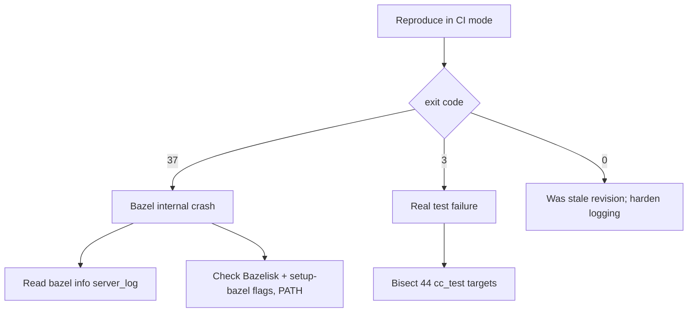

# FixTests 03 — C++ cc_test green (exit 37)

## Why

CI run [26860630245](https://github.com/vantaboard/bigquery-emulator/actions/runs/26860630245) failed `Run first-party cc_test targets via Bazel` with `task: Failed to run task "lint:cpp:test": exit status 37`. Exit **37** is Bazel `INTERNAL_ERROR` (a crash), not a test assertion failure (exit **3**). The step died in ~4 seconds with almost no Bazel output, which points at a crash or an environment problem rather than 44 slow tests.

## Decision tree



## Key facts

- Chain: `task lint:cpp:test` -> `bazel query` (discover cc_test) -> `task bazel:test` -> `googlesql:preflight` -> `bazel test --config=googlesql-prebuilt`.
- Current discovery query: `kind(cc_test, //backend/... + //binaries/... + //frontend/... + //tools/googlesql-prebuilt/smoke/...)` -> **44 targets**.
- No first-party `cc_test` is tagged flaky. Recent `backend/engine` work (UDAF wiring, routing regression tests, transpiler/disposition changes, bqutils gaps) would deterministically produce **exit 3**, not 37.
- The June-3 CI used an older `lint:cpp:test` that swallowed `bazel query` stderr (`2>/dev/null`); current [`taskfiles/lint.yml`](taskfiles/lint.yml) passes `--config={{.GOOGLESQL_BAZEL_CONFIG}}` on the query.

## Steps

1. Reproduce: `GOOGLESQL_SOURCE=prebuilt task lint:cpp:test` (see plan 01).
2. If **37**: capture `bazel info server_log`; retry `-s --verbose_failures`; verify Bazelisk version and `setup-bazel` action flags; check for duplicate `--bes_header` / bad `PATH` entries (known 37 triggers).
3. If **3**: bisect via `task bazel:test TARGETS='//backend/engine/duckdb/transpiler:...' TEST_FLAGS='--test_output=errors'`, then widen; fix the failing target(s).
4. Harden CI logging so the next failure surfaces the underlying error.

## Verify

```bash
GOOGLESQL_SOURCE=prebuilt task lint:cpp:test    # exit 0
task bazel:status                                # (clean) after; task bazel:shutdown at end
```

## Out of scope

- Conformance fixtures (plans 02, 05–07) and parity workflow (plan 04). This plan is only the cc_test lane.
