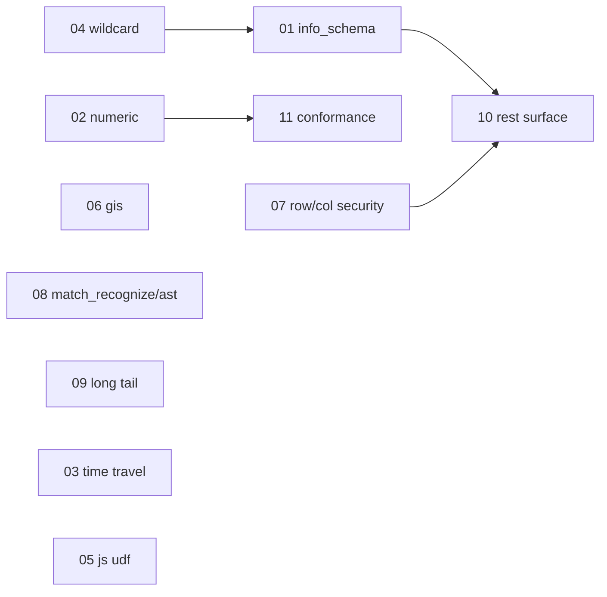

# Full — second-wave parity dispatch index

This is the successor to [parity-00-index.plan.md](parity-00-index.plan.md).
The parity 01-13 set landed the common query / DML / scripting / UDF /
storage-API surface; this set closes the gaps that block real-world
tooling (dbt, bigframes, the official client-library sample suites) and
the remaining `(planned)` / `unsupported` rows in the trackers.

Source documents (re-read before starting any sub-plan; they are the
authoritative trackers and must be updated in the same commits that land
implementations):

- [`ROADMAP.md`](../../ROADMAP.md) — milestone status (🟡 / ⏳ rows)
- [`backend/engine/duckdb/transpiler/SHAPE_TRACKER.md`](../../backend/engine/duckdb/transpiler/SHAPE_TRACKER.md) — per-node route dispositions; `(planned)` rows
- [`docs/ENGINE_POLICY.md`](../../docs/ENGINE_POLICY.md) — route vocabulary, specialized-feature postures, deferred families

Repo-wide invariants every sub-plan obeys (identical to the parity set):

1. **Promotion policy** (SHAPE_TRACKER §Promotion policy): landing a shape
   requires (a) the `Emit*` / semantic-executor / control-op / catalog
   handler and (b) conformance fixtures that exercise it, in the same change.
2. **Tracker parity**: edit `node_dispositions.yaml` / `functions.yaml`
   and the matching SHAPE_TRACKER.md row in the same commit;
   `task lint:dispositions` (wired into `task lint:run`) gates drift.
3. **No silent approximation**: a shape either lands on its route with
   exact BigQuery semantics or keeps surfacing `UNIMPLEMENTED`. A
   deterministic `local_stub` is allowed only for client-library probes
   (per ENGINE_POLICY), never as a fake answer downstream.
4. **Bazel hygiene**: one bazel invocation at a time, throttled via
   `task emulator:build-engine:bazel` / `task bazel:test`; end every
   plan with `task bazel:shutdown` + `task bazel:status` -> `(clean)`.

## Sub-plans (most impactful for real workloads → least)

| # | Plan file | Theme | Why it matters |
|---|-----------|-------|----------------|
| 01 | [full-01-information-schema.plan.md](full-01-information-schema.plan.md) | Complete `INFORMATION_SCHEMA` views (VIEWS, ROUTINES, TABLE_OPTIONS, COLUMN_FIELD_PATHS, PARTITIONS, TABLE_STORAGE, KEY_COLUMN_USAGE, JOBS_*) | dbt docs/catalog + tooling introspection; only TABLES/COLUMNS/SCHEMATA exist today |
| 02 | [full-02-numeric-decimal-precision.plan.md](full-02-numeric-decimal-precision.plan.md) | NUMERIC/BIGNUMERIC aggregate + arithmetic precision; Storage Write full type matrix | Go skip rows (`SkipEmulatorNumericAggregateQuery`, ManagedWriter DefaultStream) cite these |
| 03 | [full-03-time-travel-decorators.plan.md](full-03-time-travel-decorators.plan.md) | `FOR SYSTEM_TIME AS OF`, table decorators, snapshots, `UNDROP`/restore | Time-travel queries + table-snapshot workflows |
| 04 | [full-04-wildcard-tables.plan.md](full-04-wildcard-tables.plan.md) | Wildcard table querying + `_TABLE_SUFFIX` pseudo-column | `WildcardTable` scaffold exists but is incomplete; common in log/event datasets |
| 05 | [full-05-javascript-udf-runtime.plan.md](full-05-javascript-udf-runtime.plan.md) | Embedded JS UDF call-time execution (promote off `local_stub`) | dbt `functions/test_js`, Node sample suite |
| 06 | [full-06-geography-gis.plan.md](full-06-geography-gis.plan.md) | GEOGRAPHY type + `ST_*` via DuckDB `spatial` extension | Geography skip rows across all client lanes; `ST_GEOGPOINT` is partially landed |
| 07 | [full-07-row-column-security.plan.md](full-07-row-column-security.plan.md) | Row-access policies + column-level security / data masking enforcement | dbt `grant_access` / `column_policy`; currently structural stubs |
| 08 | [full-08-match-recognize-ast-shapes.plan.md](full-08-match-recognize-ast-shapes.plan.md) | `MATCH_RECOGNIZE` + remaining `(planned)` AST shapes (UpdateConstructor, RelationArgumentScan, CatalogColumnRef, MERGE `THEN RETURN`) | Last `status=planned` rows in `node_dispositions.yaml` |
| 09 | [full-09-scalar-relational-long-tail.plan.md](full-09-scalar-relational-long-tail.plan.md) | `GENERATE_UUID`, extended/`type_modifier` casts, weighted/stratified `TABLESAMPLE`, DATE/TIMESTAMP `RANGE` window frames | Scalar + relational long tail still surfacing `UNIMPLEMENTED` |
| 10 | [full-10-rest-surface-completion.plan.md](full-10-rest-surface-completion.plan.md) | Resumable upload, peripheral resource behavior (models/routines/rowAccessPolicies/migration/dataTransfer), jobs pagination/list filters | REST gaps behind client-library probes + load jobs |
| 11 | [full-11-conformance-breadth.plan.md](full-11-conformance-breadth.plan.md) | Widen the GoogleSQL `.test` corpus lane; shrink third-party skip matrices as shapes land | Regression net for everything above |

## Dependency sketch

01 (INFORMATION_SCHEMA) and 04 (wildcard) both build on
`backend/catalog/virtual_table.h::VirtualCatalogTable`; do 04 first only
if you want the union-scan machinery before the view set, otherwise they
are independent. Everything else is logically independent.

## Dispatch (serialized engine lane)

Full orchestration — waves, ordering, prompts, and parent hygiene — is
in [full-dispatch.plan.md](full-dispatch.plan.md) (the `full-*` analog
of [parity-dispatch.plan.md](parity-dispatch.plan.md), which it inherits
its rules from). The dominant constraint is unchanged: **every plan here
except 11's authoring phase
modifies the C++ engine and must rebuild + re-run conformance, so plans
01-10 are serialized end-to-end** (one bazel invocation per workspace;
two concurrent engine builds OOM the box). Plans also share the same
hot files (`route_classifier_visitor.cc`, `functions.yaml` /
`node_dispositions.yaml`, `SHAPE_TRACKER.md`, `googlesql_catalog.cc`,
conformance fixture dirs), so serialization on main is also the
merge-sanity answer.

- `subagent_type: generalPurpose`, `run_in_background: false` for 01-10.
- 11's corpus-vendoring + CI-YAML authoring may run in the background
  alongside one engine-lane subagent, but its *execution* steps
  (running the corpus via `jobs.query`) must wait for a bazel-quiet
  window (`task bazel:status` -> `(clean)` and `free -h` > 4 GiB).
- Run the parent cleanup block from `process-hygiene.mdc` between every
  subagent; confirm the prior plan's work is committed and
  `task lint:dispositions` is green on main before dispatching the next.

Use the per-subagent prompt template in
[full-dispatch.plan.md](full-dispatch.plan.md) "Per-subagent prompt
template" (plan path `.cursor/plans/full-<NN>-*.plan.md`).

## Verification matrix (run after each plan)

| Check | Command | Bar |
|-------|---------|-----|
| Engine build | `task emulator:build-engine:bazel` | exit 0 |
| First-party conformance | `task conformance:run` | no regressions; new fixtures pass |
| Disposition parity | `task lint:dispositions` | green |
| Lint gate | `task lint:fix && task lint:run` | green |
| Routing matrix | `task conformance:routing-matrix` | new shapes report intended route |
| Third-party (targeted) | `task thirdparty:<suite>` | per-plan; skip-matrix rows removed as shapes land |
| Bazel hygiene | `task bazel:shutdown && task bazel:status` | `(clean)` |

## Status (updated by the parent agent after each subagent returns)

| Plan | State | Conformance delta | Commits | Notes |
|------|-------|-------------------|---------|-------|
| 01 | pending | — | | |
| 02 | pending | — | | |
| 03 | pending | — | | |
| 04 | pending | — | | |
| 05 | pending | — | | |
| 06 | pending | — | | |
| 07 | pending | — | | |
| 08 | pending | — | | |
| 09 | pending | — | | |
| 10 | pending | — | | |
| 11 | pending | — | | |

## Bookkeeping per landed plan

- Drop `status=planned` / `(planned)` markers from `functions.yaml`,
  `node_dispositions.yaml`, and SHAPE_TRACKER.md rows that landed.
- Update the matching ROADMAP.md bullet (🟡/⏳ -> ✅) and the
  ENGINE_POLICY.md family table where a posture changes
  (e.g. `unsupported` -> `local_impl`, `local_stub` -> `local_impl`).
- Remove third-party skip-matrix rows (`third_party/*/emulator_*skip*`,
  `third_party/README.md`) the landed shape unblocks; re-run that suite
  to prove it.
