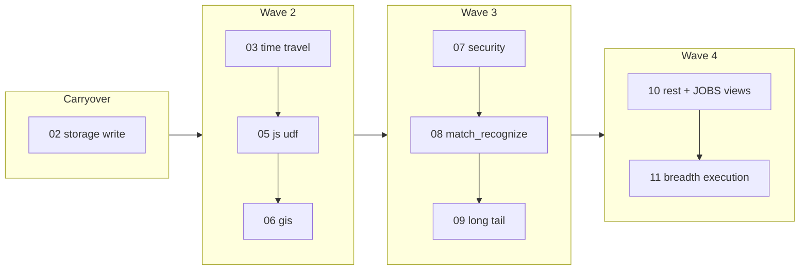

# Full — Continue (waves 2–4 + carryover)

**Successor to** [full-dispatch.plan.md](full-dispatch.plan.md) **for all remaining
execution.** The original dispatch doc stays as historical context + constraint
reference; **this file is the live runbook** — update the `NEXT` block below
after every unit.

Parent index + landed status: [full-00-index.plan.md](full-00-index.plan.md).

## NEXT (update after every unit)

```
NEXT UNIT:     (wave complete — triage remaining conformance follow-ups)
CONFORMANCE:   ~178/190 YAML pass; 85/85 googlesql-corpus pinned (de46027)
LAST COMMIT:   de46027 (waves 2–4 carryover; verify with git log -1)
BLOCKERS:      12 new conformance fixtures need follow-up / bq validation
WAVE:          complete (see full-00-index status table)
```

When starting a session, read **only** this block + the linked sub-plan for
`NEXT UNIT`. Do not re-read the entire full-00 table unless reconciling drift.

---

## Why full-dispatch felt manual

These failure modes showed up in practice; the session protocol below is the fix.

| Symptom | Root cause | Fix in this plan |
|--------|------------|------------------|
| "Pick up where we left off" every session | No single `NEXT` pointer; status split across full-00, full-dispatch todos, and sub-plan frontmatter | **`NEXT` block above** — one source of truth |
| False conformance failures (e.g. bignumeric, expr_with_expr) | Conformance ran against **stale `./bin/emulator_main`** (built before routing commit) | **Rebuild gate**: if any `backend/` or `binaries/` file changed since binary mtime → `task emulator:build-engine:bazel` before `conformance:run` |
| Work "done" but not on main | Parent/subagent left **uncommitted** diffs; next unit built on old HEAD | **Post-flight requires clean git** for the unit's paths (commit or explicit WIP note in `NEXT`) |
| Wave 1 stuck `in_progress` in full-dispatch | Wave todos not flipped when 01/02/04 landed | Mark wave1 **completed** in full-dispatch; use this file for waves 2–4 |
| Subagent returned "done" but plan todos still `pending` | Sub-plan frontmatter not updated; full-00 said "done" while full-02 todos said `pending` | **Dual update rule**: completing a unit updates sub-plan todos + full-00 row + `NEXT` block |
| User had to say "continue" / "start building" | Parent treated dispatch as **one-shot** (dispatch subagent → report → stop) instead of **chain until blocker** | **Chain rule**: after post-flight passes, immediately start `NEXT UNIT` unless OOM, user interrupt, or explicit blocker |
| Concurrent conformance + bazel OOM | Background `conformance:run` while engine build in flight | **Pre-flight audit** kills stray runners; never start conformance during bazel |
| Commit policy confusion | Workspace auto-commit rule vs user "only commit when asked" | **Default: commit each completed unit** with conventional message; user can say "WIP/no commit" for a session |

---

## Session protocol (every unit)

A **unit** is one carryover slice or one full-0N plan (or a stall fallback plan
08/09 if 06 blocks).

### Pre-flight (mandatory)

```bash
# 1. State
rtk git status
rtk git log -1 --oneline

# 2. Process audit (process-hygiene.mdc catalog)
ps -eo pid,ppid,etime,pcpu,pmem,rss,args \
 | grep -E 'bazel|clang\b|cc1|process-wrapper|emulator_main|gateway_main|bigquery-emulator|conformance/cmd/runner|/runner ' \
 | grep -vE '\bgrep\b|/usr/bin/zsh|/opt/bigquery-emulator' \
 || echo '(clean)'
free -h | head -2   # need > 4 GiB available before engine work

# 3. Rebuild gate
if git diff --name-only HEAD -- backend/ binaries/ | grep -q .; then
  task emulator:build-engine:bazel
elif [ ./bin/emulator_main -ot $(git log -1 --format=%cd --date=unix -- backend/) ]; then
  task emulator:build-engine:bazel   # engine sources newer than binary
fi
```

### Execute

1. Open the sub-plan linked from the unit todo (e.g. [full-03-time-travel](full-03-time-travel-decorators.plan.md)).
2. Work frontmatter todos **in order**; land implementation + fixtures + tracker rows together (promotion policy).
3. If blocked: write blocker into `NEXT BLOCKERS`, leave todo `pending` with note in sub-plan, **do not** approximate.

### Post-flight (mandatory)

```bash
task emulator:build-engine:bazel          # if engine changed this unit
go run ./conformance/cmd/runner --fixtures conformance/fixtures \
  --engine-binary ./bin/emulator_main --output text   # record pass count
task lint:dispositions
task lint:fix && task lint:run            # when Go/C++/disposition touched

# cleanup (process-hygiene.mdc)
task bazel:shutdown && task bazel:kill-strays && task bazel:status
pgrep -af 'emulator_main|gateway_main|conformance/cmd/runner' \
  | grep -vE 'grep|/usr/bin/zsh|/opt/bigquery-emulator' || echo '(clean)'
```

Then:

1. **Commit** the unit (unless user said WIP).
2. Update [full-00-index](full-00-index.plan.md) status row (conformance delta, commit sha, notes).
3. Mark completed todos in the **sub-plan** and in **this file**.
4. Rewrite the **`NEXT` block** at the top of this file.

### Chain rule

If post-flight is green and no blocker: **start the next unit in the same
session** without waiting for the user. Only stop when:

- User interrupts
- `free -h` available < 4 GiB and cannot reclaim
- A unit is blocked and no stall-fallback applies
- Wave 4 complete

---

## Landed (do not re-run)

| Plan | Conformance | Notes |
|------|-------------|-------|
| 01 | 161→168 | JOBS_* deferred → 10 |
| 02 | 168→170 | Core decimal path done; **carryover** below |
| 04 | 172→175 | Union + `_TABLE_SUFFIX`; suffix **prune** optional carryover |

---

## Carryover backlog (unfinished from "done" plans)

Finish these **before or interleaved with** wave 2. Prefer order below.

| ID | Source plan | Work | Verify |
|----|-------------|------|--------|
| **carryover-02-storage-write** | full-02 | `SkipEmulatorManagedWriterDefaultStream` still in `third_party/golang-bigquery-tests/.../emulator_skip.go`; proto append full decimal matrix | `task thirdparty:golang` |
| carryover-04-suffix-prune | full-04 | Constant `_TABLE_SUFFIX` filter → prune table set pre-materialize | Wildcard fixture + large-shard perf (optional) |
| carryover-01-jobs-views | full-01 → **10** | `INFORMATION_SCHEMA.JOBS` / `JOBS_BY_PROJECT` | Do with full-10, not standalone |
| carryover-11-skip-audit | full-11 | Incremental skip removal per wave; **full sweep last** | Per-suite `task thirdparty:*` |

### full-02 sub-plan todos still `pending`

The index marks 02 "done" but [full-02-numeric-decimal-precision.plan.md](full-02-numeric-decimal-precision.plan.md) frontmatter was never flipped. Treat as:

| Todo | Status | Action |
|------|--------|--------|
| reproduce-gaps | done (fixtures exist) | Flip in sub-plan when touching 02 |
| numeric-aggregate | done (semantic AVG/MIN/MAX + dfc54d9) | Flip |
| arithmetic-precision | done (route_classifier_functions + fixtures) | Flip |
| storage-append-matrix | **pending** | **carryover-02-storage-write** |
| result-encoding | mostly done | Spot-check during 02 carryover |
| fixtures-skips | partial | Remove ManagedWriter skip only |

---

## Remaining waves (serialized engine lane)

Same bazel + hot-file constraints as [full-dispatch](full-dispatch.plan.md).
**One plan at a time.** Stall rule unchanged: if 06 blocks on spatial link,
pull **08** or **09** forward.



| Order | Unit ID | Plan | Depends on |
|-------|---------|------|------------|
| 0 | carryover-02-storage-write | [full-02](full-02-numeric-decimal-precision.plan.md) (tail) | — |
| 1 | wave2-03-time-travel | [full-03](full-03-time-travel-decorators.plan.md) | — |
| 2 | wave2-05-js-udf | [full-05](full-05-javascript-udf-runtime.plan.md) | — |
| 3 | wave2-06-gis | [full-06](full-06-geography-gis.plan.md) | — |
| 4 | wave3-07-security | [full-07](full-07-row-column-security.plan.md) | — |
| 5 | wave3-08-match-recognize | [full-08](full-08-match-recognize-ast-shapes.plan.md) | — |
| 6 | wave3-09-long-tail | [full-09](full-09-scalar-relational-long-tail.plan.md) | — |
| 7 | wave4-10-rest | [full-10](full-10-rest-surface-completion.plan.md) | 01, 07 |
| 8 | wave4-11-breadth | [full-11](full-11-conformance-breadth.plan.md) | 02 + all above |

### Background lane (11)

Authoring (corpus vendoring, CI YAML) is **done** (aacdf38). Remaining 11 work
runs in **wave 4** only, in bazel-quiet windows. Do not run `task conformance:googlesql-corpus` during engine builds.

---

## Subagent vs in-thread execution

| Mode | When | Why |
|------|------|-----|
| **In-thread chain (preferred)** | Default for carryover + waves 2–4 | Avoids handoff loss, keeps `NEXT` accurate, rebuild gate enforced |
| **Foreground subagent** | Single plan > ~2h wall time and user wants parallel chat | Prompt must include: read this file's `NEXT` block, sub-plan path, post-flight + update `NEXT` |
| **Background subagent** | Never for engine plans 03–10 | Bazel single-invocation invariant |

Subagent prompt template: copy from [full-dispatch § Per-subagent prompt](full-dispatch.plan.md), but add:

```
Before ANY conformance or thirdparty run: execute the Pre-flight block in
.cursor/plans/full-continue.plan.md. After completion: Post-flight + update
the NEXT block in that file + full-00-index status row.
Chain: if green, set NEXT to the following unit and report ready-to-continue.
```

---

## Verification matrix (unchanged)

| Check | Command | Bar |
|-------|---------|-----|
| Engine build | `task emulator:build-engine:bazel` | exit 0 |
| Conformance | `go run ./conformance/cmd/runner --fixtures conformance/fixtures --engine-binary ./bin/emulator_main` | no regressions |
| Dispositions | `task lint:dispositions` | green |
| Lint | `task lint:fix && task lint:run` | green when code touched |
| Third-party | `task thirdparty:<suite>` | per carryover / plan |
| Bazel hygiene | `task bazel:shutdown && task bazel:status` | `(clean)` |

---

## Anti-patterns (inherited + new)

- Running conformance without rebuild after engine commits (**stale binary**).
- Marking a plan "done" in full-00 without flipping sub-plan todos or carryover items.
- Starting wave 10 before 07 lands.
- Full skip-matrix sweep before wave 4 (false CI failures).
- Stopping after one unit when post-flight is green and user asked to "continue the plan".
