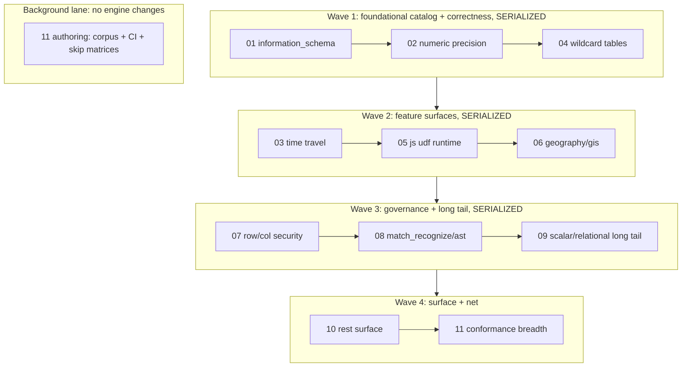

# Full — Subagent dispatch / orchestration

Execution playbook for [full-00-index](full-00-index.plan.md). This file
says **who runs, in what order, in parallel or not, with what prompt,
and what the parent does between runs**. It does not change the
sub-plans themselves. It is the `full-*` analog of
[parity-dispatch.plan.md](parity-dispatch.plan.md); the constraints and
parent-hygiene rules are identical, so this file only restates what
differs (the dependency graph and wave membership).

## The three constraints (read first)

1. **Dependency graph** (from the full-00 index):
   `04 → 01` (shared `VirtualCatalogTable` machinery; do 01 first so 04
   reuses it), `{01} → 10`, `{07} → 10`, `02 → 11`. Everything else
   (03, 05, 06, 08, 09) is logically independent.
2. **Bazel single-invocation invariant**
   (`.cursor/rules/bazel-process-hygiene.mdc` + `process-hygiene.mdc`):
   **only one bazel build per workspace at a time.** Every full plan
   except 11's authoring phase (and the Go-only pieces of 10) modifies
   the C++ engine and must rebuild + re-run conformance. Two concurrent
   engine builds — even in separate worktrees — will OOM the box.
   **Consequence: plans 01-10 are serialized end-to-end.**
3. **Shared hot files.** Nearly every plan edits one or more of
   `backend/engine/coordinator/route_classifier_visitor.cc`,
   `backend/catalog/googlesql_catalog.cc`, `functions.yaml` /
   `node_dispositions.yaml`, `SHAPE_TRACKER.md`, and conformance fixture
   dirs. Concurrent worktrees would conflict on every merge;
   serialization on main is the merge-sanity answer too.

> The only safe concurrency in this set is **plan 11's authoring**
> (corpus vendoring + CI YAML + skip-matrix edits, no engine changes)
> alongside exactly one engine-lane subagent — and even 11 must defer
> its *execution* steps (running the corpus / third-party suites) to a
> window with no bazel build in flight. Plan 10's **Go-only** pieces
> (jobs.list filters, REST round-trips that need no engine rebuild) can
> likewise interleave, but anything that rebuilds the engine serializes.

## Subagent type & mode

- `subagent_type: generalPurpose` for all of 01-11 (multi-step
  implementation; not readonly).
- `run_in_background: false` (foreground, one at a time) for the
  engine lane 01-10, so the parent serializes builds and cleans up
  deterministically between runs.
- `run_in_background: true` for 11's authoring phases (and 10's
  Go-only pieces) only.
- Do **not** use `best-of-n-runner` worktrees for more than one engine
  plan at a time (constraint 2), and prefer main-tree execution here
  because of constraint 3.

## Dispatch waves



The serialized order is value-first with dependency placement: 01 leads
because it establishes the per-view catalog machinery 04 reuses and the
introspection surface 10 fills out; 07 precedes 10 because 10's
rowAccessPolicies REST pieces coordinate with 07's enforcement; 11 sits
last because it proves everything above (and its skip-matrix sweep needs
the landed shapes).

### Wave 1 — foundational catalog + correctness (one subagent at a time)

| Order | Plan | Depends on | Why this slot |
|-------|------|------------|---------------|
| 1 | [01 information_schema](full-01-information-schema.plan.md) | — | Highest tooling payoff; generalizes `VirtualCatalogTable` for 04 + unblocks 10's introspection |
| 2 | [02 numeric precision](full-02-numeric-decimal-precision.plan.md) | — | Correctness fix; unblocks Go skip rows + feeds 11's regression net |
| 3 | [04 wildcard tables](full-04-wildcard-tables.plan.md) | 01 (machinery) | Reuses the union/materialize path from 01 |

### Wave 2 — feature surfaces

| Order | Plan | Depends on |
|-------|------|------------|
| 1 | [03 time travel / decorators / snapshots](full-03-time-travel-decorators.plan.md) | — |
| 2 | [05 javascript udf runtime](full-05-javascript-udf-runtime.plan.md) | — (registration half landed in parity-08) |
| 3 | [06 geography / gis](full-06-geography-gis.plan.md) | — |

### Wave 3 — governance + long tail

| Order | Plan | Depends on |
|-------|------|------------|
| 1 | [07 row-access & column-level security](full-07-row-column-security.plan.md) | — (coordinate persistence with 10) |
| 2 | [08 match_recognize & remaining ast shapes](full-08-match-recognize-ast-shapes.plan.md) | — |
| 3 | [09 scalar & relational long tail](full-09-scalar-relational-long-tail.plan.md) | — |

### Wave 4 — surface completion + regression net

| Order | Plan | Depends on |
|-------|------|------------|
| 1 | [10 rest surface completion](full-10-rest-surface-completion.plan.md) | 01, 07 |
| 2 | [11 conformance breadth](full-11-conformance-breadth.plan.md) | 02 + all above (sweeps skip matrices) |

### Background lane — 11 authoring (start alongside any wave)

[11 conformance-breadth](full-11-conformance-breadth.plan.md)'s
authoring phase (vendoring `.test` corpus files, editing
`.github/workflows/googlesql-parity.yml`, editing
`third_party/*/emulator_*skip*`) is engine-change-free. Dispatch it in
the background once Wave 1 starts. Its prompt must instruct it to
**check `task bazel:status` and `free -h` before any step that runs the
emulator, the corpus, or a third-party suite**, and to do
authoring-only work (or yield back) if a build is in flight or available
memory < 4 GiB. Its skip-matrix sweep is most valuable run **last**,
after the shapes it unblocks have landed — so the background instance
authors the corpus widening early and the final skip-matrix removal
happens in Wave 4.

If an earlier plan stalls (e.g. 06 blocked on the DuckDB spatial
extension link), pull forward the next dependency-free plan (03, 08, 09
are all dependency-free) rather than idling — the serialization
constraint is about *concurrency*, not strict order.

## Parent responsibilities BETWEEN every subagent

The parent agent owns cleanup regardless of what the subagent did
(`process-hygiene.mdc`, "Subagent boundary"):

```bash
# 1. Bazel server + clients + clang
task bazel:shutdown
task bazel:kill-strays
task bazel:status            # expect (clean)

# 2. Emulator / gateway / runner strays
pgrep -af 'emulator_main|gateway_main|bigquery-emulator|conformance/cmd/runner' \
  | grep -vE 'grep|/usr/bin/zsh' || echo '(clean)'

# 3. Headroom check before the next heavy subagent
free -h | head -2            # need > 4 GiB available before the next engine plan
```

Then, before dispatching the next subagent:

1. Read the returned subagent's final terminal state (don't trust
   "I cleaned up").
2. Confirm the work is **committed** (`rtk git status` clean) — the
   next subagent builds on top of it.
3. Run `task lint:dispositions` on main; a parity break here means the
   subagent left SHAPE_TRACKER / YAML drift that must be fixed before
   anything else lands.
4. Update the status table in [full-00-index](full-00-index.plan.md)
   and flip the matching wave todo in this file.

## Per-subagent prompt template

Each subagent is self-contained (it does not see this chat):

```
Read ONLY these files and follow them:
- .cursor/plans/full-<NN>-<slug>.plan.md      (your assigned plan)
- .cursor/plans/full-00-index.plan.md         (repo-wide invariants section)

Context: bigquery-emulator repo. The parity 01-13 plan set
(.cursor/plans/parity-*) is fully landed on main (common query / DML /
scripting / UDF-TVF persistence / storage-API surface). Prerequisite
full plans <list or "none"> are already merged: <one-line state, e.g.
"full-01 generalized backend/catalog/info_schema_table.h to a
table-driven per-view descriptor; see commit <sha>">.

Do the work in your plan's frontmatter todos, in order. Rules:
- Follow .cursor/rules/bazel-process-hygiene.mdc + process-hygiene.mdc
  for ANY build/test: pre-spawn audit, single bazel invocation via
  task emulator:build-engine:bazel / task bazel:test, and end with
  task bazel:shutdown + task bazel:status (expect "(clean)").
- Promotion policy: implementation + conformance fixtures land together;
  flip SHAPE_TRACKER.md + node_dispositions.yaml/functions.yaml in the
  same commit; task lint:dispositions must stay green.
- Update ROADMAP.md / docs/ENGINE_POLICY.md rows your work changes
  (unsupported -> local_impl, local_stub -> local_impl, drop (planned)).
- Commit per .cursor/rules/auto-commit.mdc (pre-commit lint gate;
  stage by hunk if you touch files with unrelated edits).
- If a todo is blocked (missing prerequisite, upstream googlesql gap,
  design dead-end), leave it pending with a written note in the plan
  file rather than approximating semantics — UNIMPLEMENTED is the
  policy-correct gap.
Return: which todos you completed (with commit shas), conformance
pass counts before/after, fixtures added, tracker rows flipped, any
blocked todos + why, and the final `task bazel:status` output.
```

For plan 11's background dispatch, append:

```
You run CONCURRENTLY with an engine-lane subagent. Before ANY step that
builds, runs bin/emulator_main, runs the corpus, or runs a third-party
suite: run `task bazel:status` and `free -h | head -2`; if a build is in
flight or available memory < 4 GiB, do authoring-only work (vendoring
.test files, CI YAML, skip-matrix edits) and retry the execution step
later. Do the skip-matrix REMOVAL sweep last, after the shapes it
unblocks have landed on main.
```

## Progress tracking

Maintain the status table in [full-00-index](full-00-index.plan.md).
Update after each subagent returns, alongside flipping this file's wave
todos. Suggested columns (mirrors the parity-00 table):

| Plan | State | Conformance delta | Commits | Notes |
|------|-------|-------------------|---------|-------|
| 01 | pending | — | | |
| ... | | | | |

## Anti-patterns to avoid

- Fanning out 01-09 as concurrent subagents because the index calls
  most of them "independent" — they are dependency-independent, not
  bazel-independent or merge-independent.
- Dispatching 04 before 01's `VirtualCatalogTable` generalization is on
  main, or 10 before 01 + 07.
- Letting 11 run `task conformance:*` or a third-party suite while an
  engine build is in flight (memory contention; see the OOM post-mortem
  in process-hygiene.mdc).
- Running 11's skip-matrix removal sweep early, before the unblocking
  shapes land — it will either re-skip or produce false CI failures.
- Skipping the parent cleanup block "because the subagent said it
  cleaned up".
- Accepting a subagent's "done" without checking `task lint:dispositions`
  and committed status on main — uncommitted or parity-broken state
  poisons every later wave.
- Promoting a row off `unsupported` / `local_stub` / `status=planned`
  without the implementation + conformance fixture in the same commit
  (no silent approximation).
