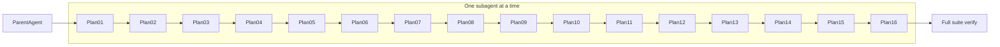

# googlesqlite Subagent Dispatch

## Goal

Run the 16 themed conformance plans derived from the baseline googlesqlite
emulator port (**568 failures** at stamp `20260603T035812Z`) **in strict
order**, using **one subagent per plan**. The parent agent orchestrates;
subagents implement.

**Inventory and test lists:** [`googlesqlite-00-index.plan.md`](googlesqlite-00-index.plan.md)

**Do not** dispatch two googlesqlite subagents in parallel. Plans have
explicit dependencies (01 before 02 before … before 16).

## Roles

| Role | Owns |
|------|------|
| **Parent agent** | Pick next pending `dispatch-NN` todo; pre-flight; launch one subagent; mandatory cleanup after return; run plan **Verify** gate; update index todos; decide pass / defer / retry |
| **Subagent** (`generalPurpose`, `run_in_background: true`) | Read one `googlesqlite-NN-*.plan.md`; implement; build/test inside plan scope; commit per auto-commit rules; report verify command output |

## Sequence



| Step | Plan file | ~Tests | Notes |
|------|-----------|--------|-------|
| 1 | [`googlesqlite-01-ddl-catalog.plan.md`](googlesqlite-01-ddl-catalog.plan.md) | 12 | Gateway + control-op DDL |
| 2 | [`googlesqlite-02-withscan-cte.plan.md`](googlesqlite-02-withscan-cte.plan.md) | 51 | DuckDB `EmitWithScan` |
| 3 | [`googlesqlite-03-operator-disposition.plan.md`](googlesqlite-03-operator-disposition.plan.md) | 4 | `$equal` / `$add` dispositions |
| 4 | [`googlesqlite-04-scan-emits.plan.md`](googlesqlite-04-scan-emits.plan.md) | 62 | ProjectScan / OrderByScan emits |
| 5 | [`googlesqlite-05-arrow-marshaling.plan.md`](googlesqlite-05-arrow-marshaling.plan.md) | 19 | `arrow_to_bq` |
| 6 | [`googlesqlite-06-aggregate-modifiers.plan.md`](googlesqlite-06-aggregate-modifiers.plan.md) | 8 | `array_agg` / `string_agg` modifiers |
| 7 | [`googlesqlite-07-semantic-core-expr.plan.md`](googlesqlite-07-semantic-core-expr.plan.md) | 27 | SubqueryExpr / scan walk |
| 8 | [`googlesqlite-08-semantic-operators.plan.md`](googlesqlite-08-semantic-operators.plan.md) | 30 | `$like`, `$in`, bitwise |
| 9 | [`googlesqlite-09-date-time.plan.md`](googlesqlite-09-date-time.plan.md) | 158 | **Single subagent**; internal phases A–D in plan; split only if subagent documents deferral |
| 10 | [`googlesqlite-10-string-hash-format.plan.md`](googlesqlite-10-string-hash-format.plan.md) | 83 | String / hash / format |
| 11 | [`googlesqlite-11-json.plan.md`](googlesqlite-11-json.plan.md) | 42 | JSON functions |
| 12 | [`googlesqlite-12-arrays-generators.plan.md`](googlesqlite-12-arrays-generators.plan.md) | 20 | Arrays / UNNEST |
| 13 | [`googlesqlite-13-advanced-relational.plan.md`](googlesqlite-13-advanced-relational.plan.md) | 3 | GROUPING SETS / PIVOT; re-check plan 05 failures |
| 14 | [`googlesqlite-14-dml-system.plan.md`](googlesqlite-14-dml-system.plan.md) | 6 | DML / `@@` vars / information_schema |
| 15 | [`googlesqlite-15-specialized-stubs.plan.md`](googlesqlite-15-specialized-stubs.plan.md) | 24 | NET / specialized 501s |
| 16 | [`googlesqlite-16-result-fixes.plan.md`](googlesqlite-16-result-fixes.plan.md) | 19 | Driver + empty-result sweep |

## Parent workflow (repeat for each `dispatch-NN`)

### Phase 1 — Pre-flight

```bash
rtk git status --short
free -h | head -2
task bazel:status   # expect (clean)
```

Refuse to dispatch if:

- Uncommitted work from a prior subagent is unexplained
- `MemAvailable` < 4 GiB (reclaim per `.cursor/rules/process-hygiene.mdc`)
- Any bazel/clang/process-wrapper client is alive (wait, attach, or `task bazel:kill-strays`)

Confirm `bin/emulator_main` exists or plan to run `task emulator:build-engine:bazel` in the subagent prompt.

### Phase 2 — Launch subagent

Use `Task` with:

- `subagent_type`: `generalPurpose`
- `run_in_background`: `true`
- `model`: omit (default) unless you need a specific slug from the allowed list

**Prompt template** (fill `NN`, `SLUG`, paths):

```text
Execute googlesqlite plan NN end-to-end.

Read fully: .cursor/plans/googlesqlite-NN-SLUG.plan.md

Requirements:
1. Implement all "Implementation steps" in that plan only.
2. Rebuild engine if C++ changed: task emulator:build-engine:bazel
3. Run the plan's **Verify** bash block exactly (copy from the plan file).
4. If Verify passes, run: ./gateway/e2e/testresults/run_googlesqlite_emulator_tests.sh
   and note pass/fail/skip delta vs baseline fail=568.
5. Follow .cursor/rules/bazel-process-hygiene.mdc inside your session:
   - One bazel command at a time; do NOT shutdown between scoped tests.
   - End YOUR session with task bazel:shutdown only if you invoked bazel.
6. Follow auto-commit + pre-commit-lint for touched paths.
7. Do NOT start the next googlesqlite plan — stop after this one.

Return: commits made, Verify output (pass/fail), full-suite summary line,
and any tests still failing in this plan's bucket.
```

**Plan 09 addendum** (append to prompt):

```text
Plan 09 is large (~158 tests). Work through Implementation steps Phase A→D
in one session. If you cannot finish, document deferral in the plan file
(what landed, what remains) and return partial Verify results — do not
silently approximate semantics.
```

### Phase 3 — Monitor

Wait for the subagent completion notification. Do not spawn the next subagent
until this one finishes.

### Phase 4 — Parent cleanup (mandatory)

Run the full cleanup block from `.cursor/rules/process-hygiene.mdc`:

```bash
task bazel:shutdown
task bazel:kill-strays
task bazel:status

pgrep -af 'emulator_main|gateway_main|bigquery-emulator' \
  | grep -vE 'grep|/usr/bin/zsh' \
  | awk '{print $1}' | xargs -r kill -TERM
sleep 1
pgrep -af 'emulator_main|gateway_main|bigquery-emulator' \
  | grep -vE 'grep|/usr/bin/zsh' || echo '(emulator/gateway clean)'
```

Re-run pre-flight before the next dispatch.

### Phase 5 — Validate gate

1. Re-run the plan **Verify** command from the plan file (parent runs it —
   do not trust subagent summary alone).
2. Optionally re-run `./gateway/e2e/testresults/run_googlesqlite_emulator_tests.sh`.
3. Update [`googlesqlite-00-index.plan.md`](googlesqlite-00-index.plan.md):
   - Set matching `gsql-index-NN` todo to `completed`.
   - Set matching `dispatch-NN` todo in **this file** to `completed`.
4. Decision:
   - **Pass:** advance to next `dispatch-(NN+1)`.
   - **Partial (plan 09 only):** split follow-up subagent targeting deferred
     section; keep `dispatch-09` `in_progress`.
   - **Fail:** leave todo `in_progress`; dispatch focused retry subagent
     with the gap only.

## Subagent build/test posture

- Prefer `task bazel:test TARGETS=...` for C++ unit tests touched by the plan.
- Integration gate is always the plan **Verify** `go test -tags=integration` block.
- Do **not** run full `./gateway/e2e/testresults/run_googlesqlite_emulator_tests.sh`
  inside every subagent unless the plan is small or you are on plan 16 — it takes
  ~minutes and spawns a long-lived `emulator_main`.
- Warm Bazel daemon **within** a subagent; parent **shuts down** between subagents.

## After plan 16

1. Run full suite:

```bash
./gateway/e2e/testresults/run_googlesqlite_emulator_tests.sh
```

2. Regenerate plan test lists from latest JSON (failures should shrink):

```bash
python3 tools/googlesqlite/plan_from_testresults.py \
  --json gateway/e2e/testresults/googlesqlite-emulator-latest.json \
  --emit-plans
```

3. **Done when:** summary shows `fail=0` (or only skips:
   `TestFilterFieldsProto`, `TestAnonymizedDPAggregate`).

## Starting a session (pickup)

1. Open this file — find lowest `dispatch-NN` with `status: pending`.
2. Confirm prior `gsql-index-(NN-1)` is `completed` in
   [`googlesqlite-00-index.plan.md`](googlesqlite-00-index.plan.md).
3. Run Phase 1 pre-flight, then Phase 2 for that plan only.

## Anti-patterns

- Parallel subagents on plans 04 and 07 (race on transpiler + semantic paths).
- Parent skipping Phase 4 cleanup (OOM on plan 09+).
- Subagent running `task bazel:shutdown` between each scoped test in one plan.
- Marking index todos complete without re-running **Verify**.
