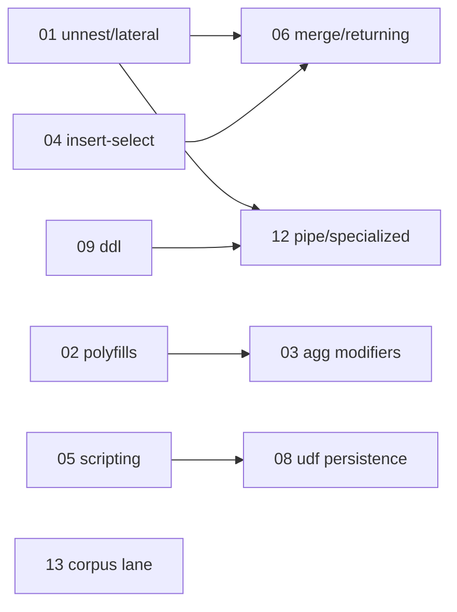

# Parity — subagent dispatch index

Source documents (re-read before starting any sub-plan; they are the
authoritative trackers and must be updated in the same commits that land
implementations):

- [`ROADMAP.md`](../../ROADMAP.md) — milestone status (🟡 / ⏳ rows)
- [`backend/engine/duckdb/transpiler/SHAPE_TRACKER.md`](../../backend/engine/duckdb/transpiler/SHAPE_TRACKER.md) — per-node route dispositions; `(planned)` rows
- [`docs/ENGINE_POLICY.md`](../../docs/ENGINE_POLICY.md) — route vocabulary, specialized-feature postures, deferred families

Repo-wide invariants every sub-plan obeys:

1. **Promotion policy** (SHAPE_TRACKER §Promotion policy): landing a shape
   requires (a) the `Emit*` / semantic-executor / control-op handler and
   (b) conformance fixtures that exercise it, in the same change.
2. **Tracker parity**: edit `node_dispositions.yaml` / `functions.yaml`
   and the matching SHAPE_TRACKER.md row in the same commit;
   `task lint:dispositions` (wired into `task lint:run`) gates drift.
3. **No silent approximation**: a shape either lands on its route with
   exact BigQuery semantics or keeps surfacing `UNIMPLEMENTED`.
4. **Bazel hygiene**: one bazel invocation at a time, throttled via
   `task emulator:build-engine:bazel` / `task bazel:test`; end every
   plan with `task bazel:shutdown` + `task bazel:status` -> `(clean)`.

## Sub-plans (most used → least used)

| # | Plan file | Theme | Frequency rationale |
|---|-----------|-------|---------------------|
| 01 | [parity-01-unnest-lateral-correlated.plan.md](parity-01-unnest-lateral-correlated.plan.md) | Lateral/cross-join UNNEST, multi-array zip, JOIN USING, correlated subqueries | `FROM t, UNNEST(t.arr)` and `JOIN USING` are bread-and-butter BigQuery; blocks countless real queries |
| 02 | [parity-02-function-polyfills.plan.md](parity-02-function-polyfills.plan.md) | `duckdb_udf` lane: IF/ISNULL/COUNTIF/MOD/DIV/LOG, datetime interval arithmetic, regex/format polyfills | Top-frequency scalar builtins currently returning UNIMPLEMENTED |
| 03 | [parity-03-aggregate-modifiers.plan.md](parity-03-aggregate-modifiers.plan.md) | ARRAY_AGG/STRING_AGG ORDER BY+LIMIT, IGNORE/RESPECT NULLS, HAVING MAX/MIN, aggregate SAFE., DISTINCT combos | Aggregate modifiers appear in most analytics workloads |
| 04 | [parity-04-insert-select-dml.plan.md](parity-04-insert-select-dml.plan.md) | `INSERT ... SELECT`, `UPDATE ... FROM`, deep-STRUCT SET, DELETE+offset, ASSERT_ROWS_MODIFIED | `INSERT ... SELECT` is the most common ETL write shape |
| 05 | [parity-05-scripting-control-flow.plan.md](parity-05-scripting-control-flow.plan.md) | IF/WHILE/LOOP/FOR, EXECUTE IMMEDIATE, SET assignment, EXCEPTION, @@error.message | Required for real stored procedures and dbt-style orchestration |
| 06 | [parity-06-merge-matrix-returning.plan.md](parity-06-merge-matrix-returning.plan.md) | MERGE `WHEN NOT MATCHED BY SOURCE` / multi-action, RETURNING | dbt incremental + CDC merge patterns |
| 07 | [parity-07-cast-collate-value-tables.plan.md](parity-07-cast-collate-value-tables.plan.md) | CAST FORMAT/AT TIME ZONE, COLLATE, SELECT AS VALUE, set-op CORRESPONDING | Moderate; value tables + cast formats recur in client-library tests |
| 08 | [parity-08-udf-tvf-persistence.plan.md](parity-08-udf-tvf-persistence.plan.md) | Durable UDF/UDAF/TVF/procedure persistence via DuckDBStorage; JS UDF registration posture | Unblocks cross-request routine workflows + routine REST round-trip |
| 09 | [parity-09-ddl-control-op.plan.md](parity-09-ddl-control-op.plan.md) | ALTER TABLE migration, CREATE MATERIALIZED VIEW, EXPORT DATA, LOAD DATA LOCAL | Closes the remaining control-op DDL matrix |
| 10 | [parity-10-storage-api-completion.plan.md](parity-10-storage-api-completion.plan.md) | Read: multi-stream + SplitReadStream + richer row_restriction; Write: PENDING + BatchCommit | Client libraries exercising Storage API at scale |
| 11 | [parity-11-relational-long-tail.plan.md](parity-11-relational-long-tail.plan.md) | Window-frame non-literal bounds, RANGE non-numeric, TABLESAMPLE seeds/stratified, WITH DEPTH, LIKE ANY/ALL | Long-tail relational shapes |
| 12 | [parity-12-pipe-and-specialized.plan.md](parity-12-pipe-and-specialized.plan.md) | Pipe subpipelines (IF/FORK/TEE/INSERT), GROUP ROWS, MATCH_RECOGNIZE, FLATTEN, inline lambdas, HLL/NET bodies | Newest syntax + specialized families; least used today |
| 13 | [parity-13-googlesql-corpus-lane.plan.md](parity-13-googlesql-corpus-lane.plan.md) | Vendor GoogleSQL `.test` corpus subset as a conformance lane | Infra: regression net for everything above |

## Dependency sketch

Plans 01–05 are independent of each other and can run in parallel
(subject to the one-bazel-at-a-time invariant: serialize builds).

## Verification matrix (run after each plan)

| Check | Command | Bar |
|-------|---------|-----|
| Engine build | `task emulator:build-engine:bazel` | exit 0 |
| First-party conformance | `task conformance:run` | no regressions; new fixtures pass |
| Disposition parity | `task lint:dispositions` | green |
| Lint gate | `task lint:fix && task lint:run` | green |
| Routing matrix | `task conformance:routing-matrix` | new shapes report intended route |
| Third-party (targeted) | `task thirdparty:<suite>` | per-plan; skip-matrix rows removed as shapes land |
| Bazel hygiene | `task bazel:shutdown && task bazel:status` | `(clean)` |

## Bookkeeping per landed plan

- Drop `status=planned` / `(planned)` markers from `functions.yaml`,
  `node_dispositions.yaml`, and SHAPE_TRACKER.md rows that landed.
- Update the matching ROADMAP.md bullet (🟡/⏳ -> ✅) and the
  ENGINE_POLICY.md family table where a posture changes.
- Remove third-party skip-matrix rows (`third_party/README.md`) that
  the landed shape unblocks; re-run that suite to prove it.
