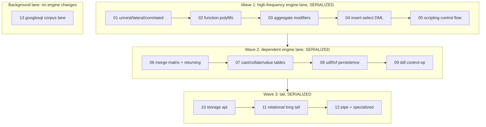

# Parity — Subagent dispatch / orchestration

Execution playbook for [parity-00-index](parity-00-index.plan.md). This
file says **who runs, in what order, in parallel or not, with what
prompt, and what the parent does between runs**. It does not change the
sub-plans themselves.

## The three constraints (read first)

1. **Dependency graph** (from the index frontmatter `depends_on` rows):
   `02 -> 03`; `04 -> 06`; `05 -> 08`; `01 -> 11`; `{01, 04, 09} -> 12`;
   `13` independent. Everything else is logically independent.
2. **Bazel single-invocation invariant**
   (`.cursor/rules/bazel-process-hygiene.mdc` + `process-hygiene.mdc`):
   **only one bazel build per workspace at a time.** Every parity plan
   except 13 modifies the C++ engine and must rebuild + re-run
   conformance. Two concurrent engine builds (even in separate
   worktrees) will OOM the box. **Consequence: plans 01-12 are
   serialized end-to-end**, even though the dependency graph marks
   01-05 as parallel.
3. **Shared hot files.** Nearly every plan edits
   `route_classifier_visitor.cc`, `functions.yaml` /
   `node_dispositions.yaml`, `SHAPE_TRACKER.md`, and conformance
   fixture dirs. Concurrent worktrees would conflict on every merge;
   serialization on main is also the merge-sanity answer, not just the
   memory one.

> The only safe concurrency in this set is **plan 13** (Go runner +
> CI wiring, no engine changes) alongside exactly one engine-lane
> subagent — and even 13 must defer its *execution* steps (running the
> corpus via `jobs.query`) to a window with no bazel build in flight.

## Subagent type & mode

- `subagent_type: generalPurpose` for all of 01-13 (multi-step
  implementation; not readonly).
- `run_in_background: false` (foreground, one at a time) for the
  engine lane 01-12, so the parent serializes builds and cleans up
  deterministically between runs.
- `run_in_background: true` for 13's authoring phases only.
- Do **not** use `best-of-n-runner` worktrees for more than one engine
  plan at a time (constraint 2), and prefer main-tree execution here
  because of constraint 3.

## Dispatch waves



The serialized order **is** the value order from the index (most-used
shapes first), with two deliberate placements: 06 and 08 sit in Wave 2
because their prerequisites (04, 05) close out Wave 1, and 12 sits last
in Wave 3 because it consumes machinery from 01, 04, **and** 09.

### Wave 1 — high-frequency engine lane (one subagent at a time)

| Order | Plan | Depends on | Why this slot |
|-------|------|------------|---------------|
| 1 | [01 unnest/lateral/correlated](parity-01-unnest-lateral-correlated.plan.md) | — | Highest-frequency gap; its outer-row primitive unblocks 11 and 12 |
| 2 | [02 function polyfills](parity-02-function-polyfills.plan.md) | — | Densest coverage-per-effort; unblocks 03 |
| 3 | [03 aggregate modifiers](parity-03-aggregate-modifiers.plan.md) | 02 | Reuses 02's UDF infra decisions |
| 4 | [04 insert-select DML](parity-04-insert-select-dml.plan.md) | — (DELETE+offset todo gated on 01, already landed) | Unblocks 06, 12 |
| 5 | [05 scripting control flow](parity-05-scripting-control-flow.plan.md) | — | Unblocks 08 |

### Background lane — 13 (start alongside Wave 1)

[13 googlesql-corpus-lane](parity-13-googlesql-corpus-lane.plan.md) is
Go + CI work against the already-built `bin/emulator_main`. Dispatch it
in the background once Wave 1 starts. Its prompt must instruct it to
**check `task bazel:status` before any step that runs the emulator or
conformance**, and to wait (or yield back) if a build is in flight.
The earlier it lands, the more regression net Waves 2-3 inherit.

### Wave 2 — dependent engine lane

| Order | Plan | Depends on |
|-------|------|------------|
| 1 | [06 merge matrix + returning](parity-06-merge-matrix-returning.plan.md) | 04 |
| 2 | [07 cast/collate/value tables](parity-07-cast-collate-value-tables.plan.md) | — (02's format-element engine helps, optional) |
| 3 | [08 udf/tvf persistence](parity-08-udf-tvf-persistence.plan.md) | 05 |
| 4 | [09 ddl control-op](parity-09-ddl-control-op.plan.md) | — |

### Wave 3 — tail

| Order | Plan | Depends on |
|-------|------|------------|
| 1 | [10 storage api completion](parity-10-storage-api-completion.plan.md) | — |
| 2 | [11 relational long tail](parity-11-relational-long-tail.plan.md) | 01 |
| 3 | [12 pipe + specialized](parity-12-pipe-and-specialized.plan.md) | 01, 04, 09 |

If an earlier plan stalls (e.g. 04 blocked on a design question), pull
forward the next plan with satisfied dependencies (07, 09, 10 are
dependency-free) rather than idling — the serialization constraint is
about *concurrency*, not strict order.

## Parent responsibilities BETWEEN every subagent

The parent agent owns cleanup regardless of what the subagent did
(`process-hygiene.mdc`, "Subagent boundary"):

```bash
# 1. Bazel server + clients + clang
task bazel:shutdown
task bazel:kill-strays
task bazel:status            # expect (clean)

# 2. Emulator / gateway / runner strays
pgrep -af 'emulator_main|gateway_main|bigquery-emulator|conformance/cmd/runner' \
  | grep -vE 'grep|/usr/bin/zsh' || echo '(clean)'

# 3. Headroom check before the next heavy subagent
free -h | head -2            # need > 4 GiB available before the next engine plan
```

Then, before dispatching the next subagent:

1. Read the returned subagent's final terminal state (don't trust
   "I cleaned up").
2. Confirm the work is **committed** (`rtk git status` clean) — the
   next subagent builds on top of it.
3. Run `task lint:dispositions` on main; a parity break here means the
   subagent left SHAPE_TRACKER / YAML drift that must be fixed before
   anything else lands.
4. Update the status table in [parity-00-index](parity-00-index.plan.md)
   and flip the matching wave todo in this file.

## Per-subagent prompt template

Each subagent is self-contained (it does not see this chat):

```
Read ONLY these files and follow them:
- .cursor/plans/parity-<NN>-<slug>.plan.md     (your assigned plan)
- .cursor/plans/parity-00-index.plan.md        (repo-wide invariants section)

Context: bigquery-emulator repo. Prerequisite plans <list or "none">
are already merged to main: <one-line state, e.g. "the outer-row
iteration primitive exists in backend/engine/semantic/; see commit <sha>">.

Do the work in your plan's frontmatter todos, in order. Rules:
- Follow .cursor/rules/bazel-process-hygiene.mdc + process-hygiene.mdc
  for ANY build/test: pre-spawn audit, single bazel invocation via
  task emulator:build-engine:bazel / task bazel:test, and end with
  task bazel:shutdown + task bazel:status (expect "(clean)").
- Promotion policy: implementation + conformance fixtures land together;
  flip SHAPE_TRACKER.md + node_dispositions.yaml/functions.yaml in the
  same commit; task lint:dispositions must stay green.
- Update ROADMAP.md / docs/ENGINE_POLICY.md rows your work changes.
- Commit per .cursor/rules/auto-commit.mdc (pre-commit lint gate;
  stage by hunk if you touch files with unrelated edits).
- If a todo is blocked (missing prerequisite, design dead-end), leave
  it pending with a written note in the plan file rather than
  approximating semantics — UNIMPLEMENTED is the policy-correct gap.
Return: which todos you completed (with commit shas), conformance
pass counts before/after, fixtures added, tracker rows flipped, any
blocked todos + why, and the final `task bazel:status` output.
```

For plan 13's background dispatch, append:

```
You run CONCURRENTLY with an engine-lane subagent. Before ANY step that
builds, runs bin/emulator_main, or executes conformance: run
`task bazel:status` and `free -h | head -2`; if a build is in flight or
available memory < 4 GiB, do authoring-only work (runner code, vendoring,
CI YAML) and retry the execution step later.
```

## Progress tracking

Maintain the status table in [parity-00-index](parity-00-index.plan.md)
(add it on first dispatch):

| Plan | State | Conformance delta | Commits | Notes |
|------|-------|-------------------|---------|-------|
| 01 | pending | — | | |
| 02 | pending | — | | |
| ... | | | | |

Update after each subagent returns, alongside flipping this file's
wave todos.

## Anti-patterns to avoid

- Fanning out 01-05 as concurrent subagents because the index calls
  them "independent" — they are dependency-independent, not
  bazel-independent or merge-independent.
- Dispatching 06 before 04's commits exist on main, or 12 before
  01 + 04 + 09 (its stubs delegate to their machinery).
- Letting 13 run `task conformance:*` while an engine build is in
  flight (memory contention; see the OOM post-mortem in
  process-hygiene.mdc).
- Skipping the parent cleanup block "because the subagent said it
  cleaned up".
- Accepting a subagent's "done" without checking `task lint:dispositions`
  and committed status on main — uncommitted or parity-broken state
  poisons every later wave.
