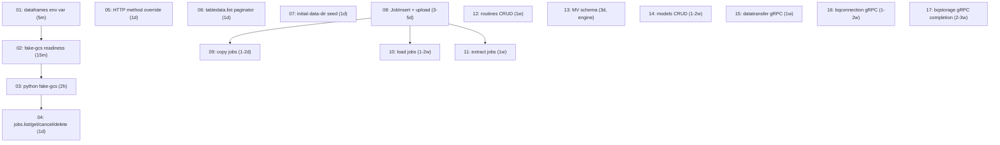

# Thirdparty completion — sequenced plan index

## Why this exists

Two upstream documents listed the remaining work that `task thirdparty`
exercises but the emulator does not yet implement:

- [`fix_thirdparty_failures_cbe91a41.plan.md`](../../../../.cursor/plans/fix_thirdparty_failures_cbe91a41.plan.md)
  — sourced from [`.logs/thirdparty-20260602-134739.log`](../../.logs/thirdparty-20260602-134739.log).
  Grouped the four failing third-party suites into a four-tier roadmap.
- [`not-implemented-routes-catalog.plan.md`](./not-implemented-routes-catalog.plan.md)
  — catalog of node-bigquery-tests routes that still return 501
  `NotImplemented`, with a one-row-per-handler-stub owner mapping.

This index replaces both. Each row below is a self-contained sibling
plan, ordered strictly easiest -> hardest, with the prerequisite chain
called out where one row materially blocks another. Plans 4, 5, and 6
have no inter-dependency and can run in any order; the numbering is by
estimated cost. Plans 9, 10, and 11 all depend on plan 8 because the
underlying job-insertion plumbing is shared.

## How to consume

1. Pick the lowest-numbered todo whose `status` is still `pending` in
   the front-matter above.
2. Read that plan file end to end before dispatching work.
3. Land the plan. Follow the auto-commit and pre-commit lint rules
   (`.cursor/rules/auto-commit.mdc`, `.cursor/rules/pre-commit-lint.mdc`).
4. Flip this index's todo entry to `completed` in the same commit as
   the last implementation commit, so the next session has a clean
   pickup point.
5. If a plan turns out to be larger than its budget once you start it,
   stop, document the deferral inline in that plan, and split it
   rather than silently re-scoping.

## Sequence at a glance

## What each plan covers

### Tier A — task-config + middleware (the trivial unblocks)

- **01**: One-line `GOOGLE_CLOUD_PROJECT` default in
  `taskfiles/thirdparty.yml` for the dataframes suite. Mirrors what
  `python-bigquery-tests` and `java-bigquery-tests` already do.
- **02**: Adds a `wait_for_healthz` poll to `fake-gcs-up`. Removes
  the docker-proxy race that breaks node-bigquery-tests preflight.
- **03**: Wires the python task through fake-gcs (depends + env +
  preflight). Unblocks `test_extract_table*`.
- **05**: Adds an `X-HTTP-Method-Override` middleware. Unblocks
  Java ACL update flows across the entire gateway surface, not just
  `AuthorizeDatasetIT`.

### Tier B — handler-only changes (single small surface each)

- **04**: Surfaces the in-memory `jobs.Registry` via `JobList`,
  `JobGet`, `JobCancel`, `JobDelete`. The sync-query path already
  populates the registry.
- **06**: Finishes `TableDataList` against `DuckDBStorage::ScanRows`
  with a `pageToken`-based paginator. ROADMAP claims this is done
  but the handler is still a stub.

### Tier C — data + jobs.insert foundation

- **07**: Snapshots `bigquery-public-data.{samples.shakespeare,
  usa_names.usa_1910_2013, usa_names.usa_1910_current}` into
  `testdata/bq-emulator/`, wires `--initial-data-dir` into compose
  and the thirdparty:emulator-up flow, and ships a refresh script
  modeled on `go-googlesql/scripts/refresh_bq_emulator_golden_usa_1910_2013.sh`.
  Prerequisite: gateway built with `-tags=seed_production_live` so
  the seed orchestrator can pull from production.
- **08**: Implements the four `gateway/handlers/jobs.go` stubs
  (`JobInsert`, `JobInsertUpload`, `JobGet`, `JobCancel`). Sequenced
  as sync-query -> load-job -> DDL-via-job -> resumable upload.
  Required by plans 09, 10, 11.

### Tier D — load / extract / copy on top of the jobs surface

- **09**: Copy jobs (single + multi-source). Lowers to
  `INSERT INTO dst SELECT * FROM src`; no GCS dependency.
- **10**: Load jobs from GCS and local files. Adds
  `Storage::LoadFromURIs(table, sourceURIs, format, schema?,
  writeDisposition)` on top of DuckDB's `read_csv_auto` /
  `read_json` / `read_parquet`. Avro / ORC / Firestore-backup land
  as a follow-on once CSV/JSON/Parquet pass.
- **11**: Extract jobs to GCS (CSV / JSON / compressed). Adds
  `Storage::ExportToURI(table, destinationURI, format, compression)`
  via DuckDB `COPY (...) TO 'gs://...'` after fake-gcs URL rewriting.
  Shares the GCS rewriting layer with plan 10.

### Tier E — engine-side feature work (each multi-day to multi-week)

- **12**: Routines CRUD. Adds a storage routine registry and wires
  the `gateway/handlers/routines.go` surface; coordinates with the
  query-time UDF lookup tracks (`udf-tvf-module-routing.plan.md`,
  `duckdb-polyfill-udf-library.plan.md`).
- **13**: Materialized view output-schema resolution. Engine fix in
  `backend/catalog/`; unblocks `QueryMaterializedViewIT`.
- **14**: Models CRUD (BQML). Designs the engine model registry,
  then wires `gateway/handlers/models.go`.

### Tier F — large gRPC ports (each multi-week)

- **15**: Wrap `gateway/handlers/datatransfer/handler.go` in a gRPC
  adapter — fastest of the three because the data model exists.
- **16**: Register `bigquery.connection.v1` per the existing
  intake table in `gateway/handlers/bqconnection/server.go`.
- **17**: Finish `bigquery.storage.v1` — extends the existing
  `storage-read-write-api-plan.plan.md` Notes section by landing
  the four deferred families (BUFFERED stream + FlushRows, PENDING
  stream + FinalizeWriteStream, atomic BatchCommitWriteStreams,
  Avro output, SplitReadStream).

## Conventions across the split

- Each sibling plan keeps a `## Source` section pointing back to the
  exact line of `fix_thirdparty_failures_cbe91a41.plan.md` or
  `not-implemented-routes-catalog.plan.md` that motivated it, so the
  audit trail is preserved after the two sources are deleted.
- Each plan declares its prerequisite plans up front. A subagent that
  picks plan N must confirm plans N-1 downward in the chain are
  `completed` here before starting.
- Plans 15, 16, 17 are sized as standalone follow-ups. Each is
  big enough that splitting it further is a near-term ask; if the
  chosen subagent runs out of budget, defer the remaining sub-rows
  in the plan's own `## Notes & deferrals` section (precedent:
  `storage-read-write-api-plan.plan.md`).

## Out of scope (unchanged from the catalog)

- IAM custom methods (`tables.{get,set,test}IamPolicy`,
  `rowAccessPolicies.*`): no upstream sample pressure.
- `migration.workflows.*`: same.
- `datasets.undelete`: engine has no soft-delete state.

These stay 501 with no failure pressure; revisit when an upstream
sample starts exercising them.
