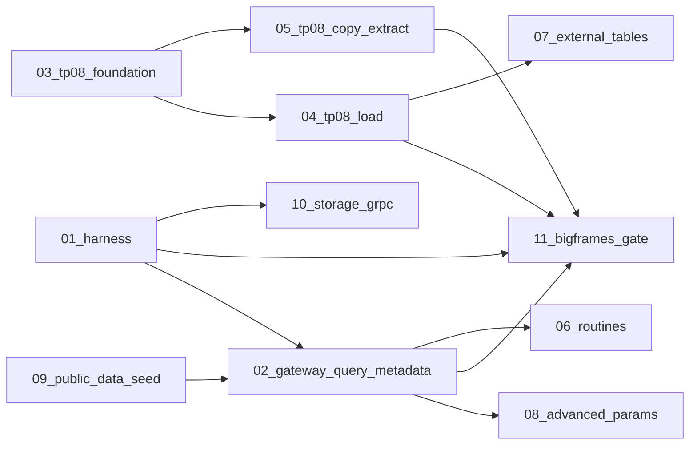

# Thirdparty full parity — subagent dispatch index

This index replaces the monolithic plan at `~/.cursor/plans/thirdparty_full_parity_59441583.plan.md`. Each linked plan is **self-contained**: scope, files, verification, dependencies, and out-of-scope boundaries.

## Baseline (2026-06-05 log)

| Suite | Result | Primary blockers |
|-------|--------|------------------|
| `golang-bigquery-tests` | OK | — |
| `python-bigquery-tests` | 34 failed | tp08, routines, external tables, query-param JSON, metadata PATCH |
| `node-bigquery-tests` | 59 failed | tp08, query-param JSON, public-data, metadata, harness (models skip) |
| `java-bigquery-tests` | panic exit=2 | Task shell bug; then storage gRPC UNIMPLEMENTED |
| `python-bigquery-dataframes-snippet-gate` | 33 errors | harness (-k split, fake-gcs, polars) |

## Sub-plans (implementation order)

| # | Plan file | Est. effort | Unblocks |
|---|-----------|-------------|----------|
| 01 | [thirdparty-01-harness.plan.md](thirdparty-01-harness.plan.md) | 1–2 days | Honest signal for java + dataframes + node models |
| 02 | [thirdparty-02-gateway-query-metadata.plan.md](thirdparty-02-gateway-query-metadata.plan.md) | 3–5 days | ~15 query/metadata python + node failures |
| 03 | [thirdparty-03-tp08-jobs-foundation.plan.md](thirdparty-03-tp08-jobs-foundation.plan.md) | 2–3 days | tp08 load/copy/extract handlers |
| 04 | [thirdparty-04-tp08-load-jobs.plan.md](thirdparty-04-tp08-load-jobs.plan.md) | 1–2 weeks | ~20 load-job failures (python + node) |
| 05 | [thirdparty-05-tp08-copy-extract-undelete.plan.md](thirdparty-05-tp08-copy-extract-undelete.plan.md) | 3–5 days | copy, extract, undelete families |
| 06 | [thirdparty-06-routines-crud.plan.md](thirdparty-06-routines-crud.plan.md) | ~1 week | python `test_routine_samples*`, node Routines |
| 07 | [thirdparty-07-external-tables.plan.md](thirdparty-07-external-tables.plan.md) | 1–2 weeks | external GCS/Sheets query samples |
| 08 | [thirdparty-08-advanced-query-params.plan.md](thirdparty-08-advanced-query-params.plan.md) | ~1 week | TIMESTAMP/STRUCT params, schema add/relax jobs |
| 09 | [thirdparty-09-public-data-seed.plan.md](thirdparty-09-public-data-seed.plan.md) | 3–5 days | `bigquery-public-data` node/python queries |
| 10 | [thirdparty-10-storage-grpc.plan.md](thirdparty-10-storage-grpc.plan.md) | 2+ weeks | Java `WriteBufferedStreamIT`, `StorageArrowSampleIT` |
| 11 | [thirdparty-11-bigframes-gate.plan.md](thirdparty-11-bigframes-gate.plan.md) | 2–3 days | 4 snippet-gate smokes (after 01 + upstream features) |

## Dependency graph



**Parallel lanes after 01:**
- Lane A: `02 → 06` (gateway query/metadata, then routines)
- Lane B: `03 → 04 → 05` (tp08 chain)
- Lane C: `09` (public-data seed, independent)
- Lane D: `10` (storage gRPC, long pole; only needs 01 for java allowlist)

**Convergence:** `11` runs after `01` harness + whichever feature plans its 4 tests need (typically `02` + `04`).

## Per-subagent instructions

1. Read **only** your assigned plan file plus this index section for dependencies.
2. Do **not** start dependent plans until their prerequisites are merged (or note explicit stubs).
3. Prefer **gateway unit tests** and **conformance fixtures** before full `task thirdparty:*` (docker rebuild is slow).
4. Follow [`.cursor/rules/bazel-process-hygiene.mdc`](../rules/bazel-process-hygiene.mdc) and [`.cursor/rules/process-hygiene.mdc`](../rules/process-hygiene.mdc) for heavy commands.
5. Update `docs/REST_API.md` / `ROADMAP.md` / `docs/ENGINE_POLICY.md` **within each plan** as routes land (do not defer to a separate docs-only pass).

## Verification (full aggregator)

```bash
task thirdparty   # all five suites; THIRDPARTY_FRESH_VOLUME=1 by default
```

**Target counts vs baseline:**
- Python: 34 failed → 0
- Node: 59 failed → 0
- Java: panic → 0 (all 4 Maven modules complete)
- Dataframes gate: 33 errors → 0 (4 tests pass)

## Archived monolith

The original combined plan remains at `~/.cursor/plans/thirdparty_full_parity_59441583.plan.md` for reference; **do not execute it as a single unit** — use the numbered sub-plans above.
