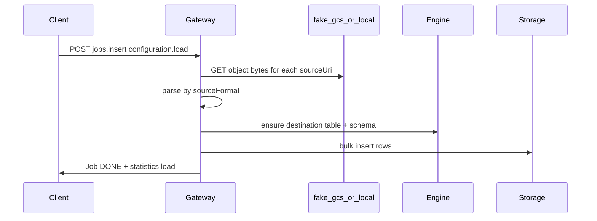

# Thirdparty 04 — tp08 LOAD jobs

## Goal

Clear **~20 load-job failures** in python and node thirdparty suites.

## Log signature

```
jobs.insert: only configuration.query is implemented; load / copy / extract paths land in thirdparty-08.
```

Also: `This BigQuery emulator route is registered but not yet implemented` for resumable upload route.

## Architecture



## Python tests unblocked (baseline)

- `test_client_load_partitioned_table`
- `test_load_table_clustered`, `test_load_table_dataframe`, `test_load_table_file`
- `test_load_table_uri_*` (csv, json, avro, parquet, orc, autodetect, truncate variants, cmek)
- Node: `should load a local CSV file`, all GCS load variants (items 34–55)

## Implementation phases

### Phase A — GCS + CSV/JSON (highest ROI)

**Files:**
- [`gateway/handlers/jobs.go`](../../gateway/handlers/jobs.go) — `runSyncLoadInsert`
- New package e.g. [`gateway/load/`](../../gateway/load/) — URI fetch + parse
- Reuse fake-gcs fixtures from `testdata/fake-gcs-data/` (`task testdata:fake-gcs-sync`)

**GCS fetch:** Translate `gs://bucket/object` → `http://127.0.0.1:4443/storage/v1/b/{bucket}/o/{object}?alt=media` (or fake-gcs download URL).

**Local files:** Node `load a local CSV` — support `file://` paths or temp upload dir.

### Phase B — Avro / Parquet / ORC

Use DuckDB `read_parquet` / Arrow libraries in gateway (Go) or delegate to engine via new RPC. Priority order matches failing test count: Parquet, Avro, ORC.

### Phase C — Write disposition + schema updates

- `writeDisposition: WRITE_TRUNCATE` — truncate destination before load
- `schemaUpdateOptions.allowAddColumns` / `allowRelaxColumns` — node items 47–48, python add/relax via **load job** (distinct from query-job path in plan 08)

### Phase D — Resumable upload (`JobInsertUpload`)

[`gateway/handlers/jobs.go`](../../gateway/handlers/jobs.go) `JobInsertUpload` currently `NotImplemented`.

Required for python `test_load_table_file` and docs resumable-upload snippets.

Spec: [`docs/bigquery/docs/reference/api-uploads.md`](../../docs/bigquery/docs/reference/api-uploads.md)

## Engine interaction

Options (pick one, document in plan PR):
1. **Gateway-only:** Parse files in Go, batch `tabledata.insertAll` REST internally
2. **Engine RPC:** Add `BulkLoad` to [`proto/emulator.proto`](../../proto/emulator.proto) — better for large files

Existing engine note: `RESOLVED_AUX_LOAD_DATA_STMT` is UNIMPLEMENTED in [`backend/engine/control/control_op_executor.cc`](../../backend/engine/control/control_op_executor.cc) for SQL `LOAD DATA`; REST load jobs are a **separate path** (gateway orchestration).

## Verification

```bash
# Prerequisites
task testdata:fake-gcs-sync
task thirdparty:fake-gcs-up

# Fast
go test ./gateway/... -count=1 -run Load

# Full
task thirdparty:python-bigquery-tests
task thirdparty:node-bigquery-tests
```

Filter to load families first:
```bash
PYTHON_SAMPLES_PYTEST_ARGS='samples/tests/test_load_table_uri_csv.py -v' task thirdparty:python-bigquery-tests
```

## Out of scope

- COPY / EXTRACT jobs (plan 05)
- External table **queries** (plan 07)
- Cloud Firestore backup format (low priority — skip or 501 with clear message)

## Done when

- [ ] All `test_load_table_uri_*` and node GCS load tests pass against fake-gcs
- [ ] Local CSV load passes
- [ ] Resumable upload route accepts payloads (or documented deferral with test skip removed)
- [ ] `ROADMAP.md` tp08 load section updated
