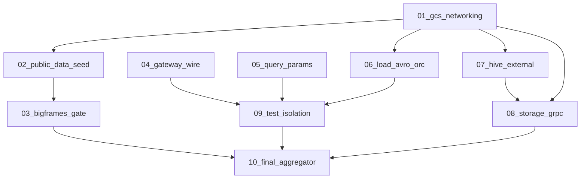

# Unblock thirdparty blockers — subagent dispatch index

This index replaces the monolithic plan at `~/.cursor/plans/unblock_thirdparty_blockers_36ae3c69.plan.md`. Each linked plan is **self-contained**: scope, files, verification, dependencies, and out-of-scope boundaries.

**Context:** Plans `thirdparty-01` through `thirdparty-11` landed partial parity (see [thirdparty-orchestration-status.md](thirdparty-orchestration-status.md)). This unblock lane drives `task thirdparty` from the **post-dispatch baseline** to zero failures.

## Baseline (2026-06-05 aggregator log)

| Suite | Result | Primary blockers |
|-------|--------|------------------|
| `golang-bigquery-tests` | OK | — |
| `python-bigquery-tests` | 1 failed | `test_client_query_total_rows` — seed has 3 TX rows, expects 100 |
| `node-bigquery-tests` | 45 failed | Jobs/GCS (22), query params (7), JSON wire (5), seed (2), isolation (3), external (2) |
| `java-bigquery-tests` | 1 module fail | `CreateTableExternalHivePartitionedIT` + fake-gcs unreachable from container |
| `python-bigquery-dataframes-snippet-gate` | 2/4 pass | `OrderByScan` 501; `session_info` missing on cache/peek |

## Sub-plans (strict sequential order)

| # | Plan file | Est. effort | Unblocks |
|---|-----------|-------------|----------|
| 01 | [unblock-01-gcs-networking.plan.md](unblock-01-gcs-networking.plan.md) | ~1 day | Container `gs://` fetch; ~22 node Jobs + java hive + external GCS |
| 02 | [unblock-02-public-data-seed.plan.md](unblock-02-public-data-seed.plan.md) | ~0.5 day | python `test_client_query_total_rows`; node Views (2) |
| 03 | [unblock-03-bigframes-gate.plan.md](unblock-03-bigframes-gate.plan.md) | 2–3 days | 4/4 snippet gate (`sessionInfo` + `OrderByScan`) |
| 04 | [unblock-04-gateway-wire-shapes.plan.md](unblock-04-gateway-wire-shapes.plan.md) | 1–2 days | ~5 node JSON/labels/dataset failures |
| 05 | [unblock-05-query-params.plan.md](unblock-05-query-params.plan.md) | 3–5 days | ~7 node Queries param failures |
| 06 | [unblock-06-load-avro-orc.plan.md](unblock-06-load-avro-orc.plan.md) | ~1 week | Remaining load/copy/extract after GCS fix; AVRO/ORC |
| 07 | [unblock-07-hive-external.plan.md](unblock-07-hive-external.plan.md) | ~1 week | `CreateTableExternalHivePartitionedIT`; hive node samples |
| 08 | [unblock-08-storage-grpc.plan.md](unblock-08-storage-grpc.plan.md) | 2+ weeks | Java `WriteBufferedStreamIT`, `StorageArrowSampleIT` (full gRPC) |
| 09 | [unblock-09-test-isolation.plan.md](unblock-09-test-isolation.plan.md) | ~1 day | `Already Exists` / cascade `Not Found` node failures |
| 10 | [unblock-10-final-aggregator.plan.md](unblock-10-final-aggregator.plan.md) | ~0.5 day | Full `task thirdparty`; publish status vs baseline |

## Dependency graph



**Strict sequence for subagents:** `01 → 02 → 03 → 04 → 05 → 06 → 07 → 08 → 09 → 10`

Plans 04 and 05 are gateway-only and could run in parallel in theory, but this index assumes **one subagent at a time** in numeric order to minimize merge conflicts.

## Per-subagent instructions

1. Read **only** your assigned `unblock-NN-*.plan.md` plus this index (deps section).
2. Do **not** edit `unblock-00-index` or `thirdparty-orchestration-status.md` unless the plan says so.
3. Prefer **fast gates** (`go test`, scoped `task thirdparty:*`) before full `task thirdparty`.
4. Follow [`.cursor/rules/bazel-process-hygiene.mdc`](../rules/bazel-process-hygiene.mdc) and [`.cursor/rules/process-hygiene.mdc`](../rules/process-hygiene.mdc).
5. On pass: `task lint:fix && task lint:run` (lint-relevant paths), conventional commit, update row in [thirdparty-orchestration-status.md](thirdparty-orchestration-status.md).
6. **Retry once** on failure; on second failure mark **DEFERRED** in status and continue (parent orchestrator only).

## Subagent prompt template

```
You are executing unblock plan NN only.

Read:
- .cursor/plans/unblock-NN-<name>.plan.md
- .cursor/plans/unblock-00-index.plan.md (deps section only)

Constraints:
- Do NOT edit unblock-00-index or dispatch/orchestration workflow files unless the plan says so.
- Prefer fast gates before full task thirdparty:*.
- Follow bazel-process-hygiene and process-hygiene rules.
- Return: PASS | PARTIAL | DEFERRED, commit hash, fast-gate output, remaining blockers.

Prior context: thirdparty plans 01–11 landed at commits through f1f41cc; baseline log .logs/thirdparty-20260605-134407.log.
```

## Verification (full aggregator)

Plan **10** runs:

```bash
mkdir -p .logs
THIRDPARTY_REBUILD=1 task thirdparty 2>&1 | tee .logs/thirdparty-$(date +%Y%m%d-%H%M%S).log
```

**Target vs post-dispatch baseline:**

| Suite | Baseline | Target |
|-------|----------|--------|
| golang | OK | OK |
| python snippets | 1 fail | 0 |
| node | 45 fail | 0 |
| java | 1 module fail | 0 (no unexpected ITs) |
| bigframes gate | 2 fail | 4 pass |

## Archived monolith

The combined unblock plan remains at `~/.cursor/plans/unblock_thirdparty_blockers_36ae3c69.plan.md` for reference; **do not execute it as a single unit** — use the numbered `unblock-NN` sub-plans above.
