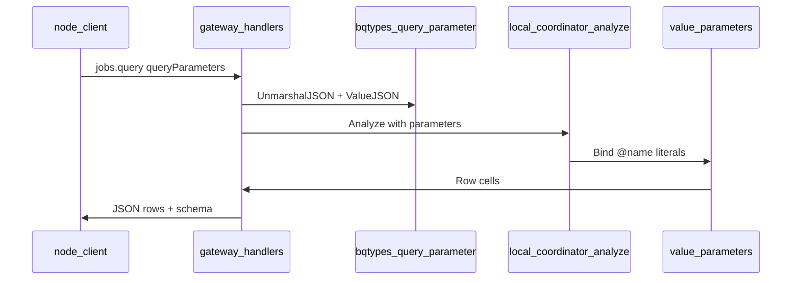

# Unblock 05 — Query parameters

## Goal

Clear **~7 node Queries failures** for ARRAY, scalar, STRUCT, and TIMESTAMP parameterized queries. Builds on partial plan 08 work (commit `5e582b1`).

## Log signatures

```
LocalCoordinatorEngine: parameter type kind 'ARRAY' is not supported by the coordinator's analyzer plumbing
expected 'Rows:' to match /word_count/
expected 'Rows:\nundefined' to match /foo/ or /BigQueryTimestamp/
```

## Architecture



## Implementation

### 1. ARRAY (coordinator)

[`backend/engine/coordinator/local_coordinator_analyze.cc`](../../backend/engine/coordinator/local_coordinator_analyze.cc) ~L246 explicitly rejects ARRAY.

- Extend parameter type mapping to `ARRAY<element>` (gateway already marshals in [`gateway/bqtypes/query_parameter.go`](../../gateway/bqtypes/query_parameter.go))
- Follow STRUCT path patterns in same file / [`value_parameters.cc`](../../backend/engine/value_parameters.cc)

### 2. Scalar / STRUCT / TIMESTAMP results

- [`gateway/handlers/queries.go`](../../gateway/handlers/queries.go) `parametersToEngineMap`
- [`gateway/bqtypes/wire.go`](../../gateway/bqtypes/wire.go) — TIMESTAMP micros, STRUCT nested fields
- Ensure `assembleQueryResponse` serializes non-null cells (not `undefined` in node assertions)

### 3. Tests

```bash
go test ./gateway/handlers/... -count=1 -run 'QueryParameter|Timestamp|Struct|Array'
```

Add conformance fixture if TIMESTAMP param still gaps (optional from plan 08).

### Bazel (if engine touched)

```bash
task bazel:test -- //backend/engine/coordinator/...:*param*
```

## Node samples reference

`third_party/node-bigquery-tests/` Queries section — parameterized query tests (#6–15 in aggregator log).

## Out of scope

- Full python 34-test baseline (snippets session is mostly skipped)
- Named query parameters in DML only paths not covered by node samples

## Done criteria

- [ ] ARRAY UNIMPLEMENTED error gone for node ARRAY param tests
- [ ] Scalar/STRUCT/TIMESTAMP node query tests return matching row text
- [ ] Gateway + scoped engine tests green
