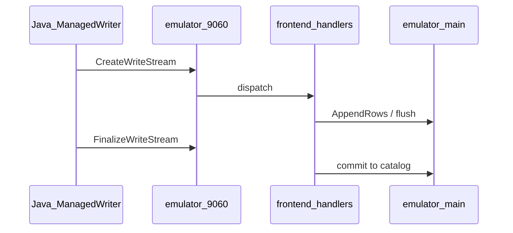

# Unblock 08 — Storage gRPC full

## Goal

Implement storage gRPC surfaces so Java thirdparty ITs pass **without** relying on `JAVA_BQ_ALLOW_FAILING_ITS`. User explicitly chose **full implementation** over allowlist expansion.

Consolidates and extends [thirdparty-10-storage-grpc.plan.md](thirdparty-10-storage-grpc.plan.md) in the unblock lane context.

## Baseline

| IT | Module | Error |
|----|--------|-------|
| `WriteBufferedStreamIT` | `java-bigquerystorage/samples/snippets` | `UNIMPLEMENTED` (partial BUFFERED at `fb36866`) |
| `StorageArrowSampleIT` | same | `UNIMPLEMENTED` |

Other Java modules use allowlist for transfer/connection snippets — keep honest allowlist for **non-storage** UNIMPLEMENTED RPCs.

## Partial work (do not redo)

- [`frontend/handlers/storage_write_buffered.cc`](../../frontend/handlers/storage_write_buffered.cc) — BUFFERED flush engine path
- [`docs/ENGINE_POLICY.md`](../../docs/ENGINE_POLICY.md) — storage posture section

## Architecture



## Phase A — Write API

**Protos / entrypoints:**

- [`proto/`](../../proto/) storage write definitions
- [`frontend/handlers/`](../../frontend/handlers/) gRPC service impls
- [`gateway/gateway.go`](../../gateway/gateway.go) or engine mux on `:9060`

**RPCs:**

1. `CreateWriteStream` — stream resource + schema
2. `AppendRows` — protobuf rows or Arrow IPC per client
3. `FinalizeWriteStream` — commit to destination table
4. `BatchCommitWriteStreams` — if required by IT

Honor `PENDING` vs `COMMITTED` per API contract.

## Phase B — Read API

1. `CreateReadSession` (audit existing partial impl)
2. Arrow-encoded `ReadRows` stream
3. Schema compatibility with table metadata for `StorageArrowSampleIT`

## Phase C — Allowlist shrink

[`taskfiles/thirdparty.yml`](../../taskfiles/thirdparty.yml) `JAVA_BQ_ALLOW_FAILING_ITS`:

- Remove `WriteBufferedStreamIT`, `StorageArrowSampleIT` once green
- Keep transfer/connection ITs until those products are out of scope

## Testing strategy

```bash
# Fast (per iteration — ONE bazel invocation)
task bazel:test -- //frontend/handlers/...storage*

# Scoped Java
JAVA_BQ_SAMPLE_PATHS='java-bigquerystorage/samples/snippets' task thirdparty:java-bigquery-tests

# Full Java (plan 10 verifies)
task thirdparty:java-bigquery-tests
```

## Hygiene (mandatory)

Per [`.cursor/rules/bazel-process-hygiene.mdc`](../rules/bazel-process-hygiene.mdc):

- One `bazel build/test` at a time
- Pre-spawn `task bazel:status`
- End-of-plan `task bazel:shutdown` + kill-strays

Do **not** start this plan until plans **01** and **07** are stable — debugging GCS + gRPC simultaneously is costly.

## Out of scope

- BigQuery Read SQL API (REST) changes unrelated to storage ITs
- ManagedWriter client library changes in `third_party/`

## Done criteria

- [ ] `java-bigquerystorage/samples/snippets` mvn verify exit 0 without allowlist for write/read ITs
- [ ] `ENGINE_POLICY.md` reflects implemented RPCs
- [ ] No new unexpected failing ITs in other Java modules
