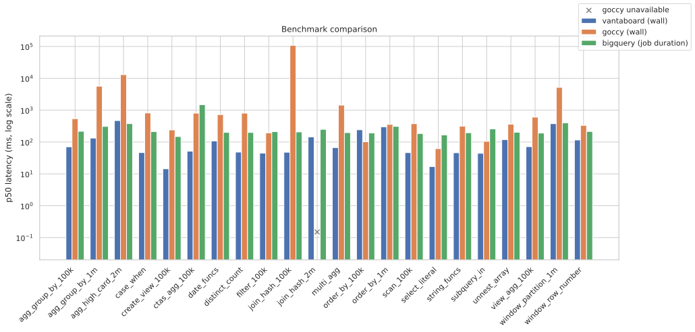
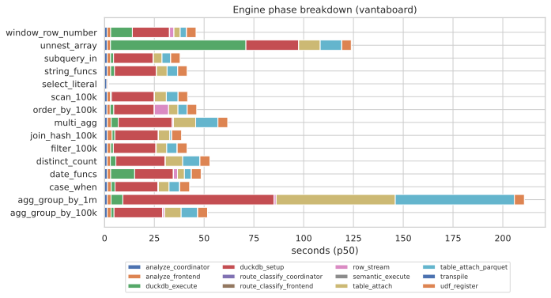

# BigQuery Emulator

[](https://github.com/vantaboard/bigquery-emulator/actions/workflows/ci.yml)
[](https://github.com/vantaboard/bigquery-emulator/releases/latest)
[](https://vantaboard.github.io/bigquery-emulator/)
[](https://vantaboard.github.io/bigquery-emulator/coverage/)
[](https://vantaboard.github.io/bigquery-emulator/coverage/go.html)
[](https://vantaboard.github.io/bigquery-emulator/coverage/cpp/index.html)
[](go.mod)

A locally-runnable emulator of Google Cloud BigQuery, intended for local
development and integration testing of applications that target the
BigQuery REST API.

> **Status:** preview (`v0.x`). The Go REST gateway implements
> projects / datasets / tables / tabledata / jobs / queries end-to-end
> against the C++ engine, plus wired stubs for the surfaces client
> libraries probe at startup (models, routines, row-access policies,
> migration, data transfer, discovery). The C++ engine links GoogleSQL
> directly and runs a **local execution coordinator** behind a single
> `Engine` interface: a resolved-AST router dispatches each query
> shape to the strategy that fits — DuckDB-native SQL for fast
> analytical work, DuckDB UDFs / rewrites for the BigQuery functions
> we can polyfill, a local semantic executor for exact BigQuery
> evaluation, and storage/catalog handlers for DDL and metadata
> operations. Results land back as REST `f`/`v` JSON or, on the
> internal gRPC Storage Read API, as native Arrow batches.
> DDL (`CREATE TABLE`, `CREATE TABLE AS SELECT`, `DROP TABLE`, …) and
> DML (`INSERT`, `UPDATE`, `DELETE`, `MERGE`, pipe INSERT, deep-STRUCT
> `UPDATE`, `THEN RETURN` on INSERT/UPDATE/DELETE) execute locally.
> GoogleSQL does not define `THEN RETURN` on MERGE.
> See [`ROADMAP.md`](./ROADMAP.md) for the capability-area
> narrative and the [documentation site](https://vantaboard.github.io/bigquery-emulator/)
> (or [`docs/README.md`](./docs/README.md)) for the full guide index.

## Architecture

This emulator is modeled directly on Google's
[`cloud-spanner-emulator`](https://github.com/GoogleCloudPlatform/cloud-spanner-emulator):

```
+-------------------------------+        +-----------------------------------+
|  gateway_main (Go)            |  gRPC  |  emulator_main (C++)              |
|                               | <----> |                                   |
|  - Implements BigQuery REST   |        |  - Links GoogleSQL directly       |
|    (projects/datasets/tables/ |        |  - Local execution coordinator:   |
|     jobs/queries/insertAll)   |        |      - DuckDB fast path           |
|  - Spawns engine as subproc   |        |      - DuckDB UDFs / rewrites     |
|                               |        |      - Local semantic executor    |
|                               |        |      - Catalog / control ops      |
|                               |        |  - DuckDB-backed persistent store |
+-------------------------------+        +-----------------------------------+
```

- The **engine is C++** so it can link [GoogleSQL](https://github.com/google/googlesql)
  directly. SQL parsing, name resolution, and type inference come from
  upstream; execution dispatches through a local route classifier that
  picks the right local strategy for each resolved-AST shape.
- DuckDB is the **fast analytical path**, not the whole engine. Shapes
  that lower cleanly run there; shapes that need exact BigQuery
  semantics run on a local semantic executor; DDL and metadata ops go
  through the catalog/storage layer directly.
- The **REST gateway is Go** — REST routes, jobs lifecycle, datasets/tables/projects
  model, streaming inserts, error envelope, discovery doc.
- The Go gateway spawns the C++ engine as a subprocess on startup and
  shuts it down cleanly on exit, identical to how `gateway_main` spawns
  `emulator_main` in the Spanner emulator.
- The whole stack runs **local-only** — query work never forwards to a
  real BigQuery project.

See [`ROADMAP.md`](./ROADMAP.md) for the design rationale and
[`docs/ENGINE_POLICY.md`](./docs/ENGINE_POLICY.md) for the route catalog.

[goccy]: https://github.com/goccy/bigquery-emulator

## Quickstart

The fastest path is the published Docker image — no Bazel build, no
GoogleSQL toolchain:

```bash
docker run --rm -p 9050:9050 ghcr.io/vantaboard/bigquery-emulator:latest

# In another shell:
curl -fsS http://localhost:9050/healthz
curl -fsS -X POST http://localhost:9050/bigquery/v2/projects/test/queries \
    -H 'Content-Type: application/json' \
    -d '{"query":"SELECT 1 AS n","useLegacySql":false}'
```

To build and run locally:

```bash
mise install                              # or: task tools:install
task emulator:build-engine:bazel          # stages bin/emulator_main + bin/libduckdb.so
task emulator:run-full                    # gateway on :9050, engine on :9060
```

The engine binary discovery defaults to looking for `emulator_main` next to
`bigquery-emulator-gateway`. Pass `--engine_binary=<path>` to override, or
`--engine_binary=""` to skip the engine subprocess entirely.

**Next steps:** [Docker](./docs/DOCKER.md) · [Client libraries](./docs/CLIENTS.md) ·
[Development setup](./docs/DEVELOPMENT.md) · [Releases](./docs/RELEASES.md)

## Benchmarks

The [`bench/`](./bench/) harness compares query latency and correctness
across three backends: this emulator (vantaboard), the
[goccy/bigquery-emulator](https://github.com/goccy/bigquery-emulator)
Docker image (`0.8.1`), and committed BigQuery golden baselines. Run
locally with `task bench:run`; see [`bench/README.md`](./bench/README.md)
for case format, baseline capture, phase timing, and profiling.

Charts below are regenerated by `task bench:charts` (and CI on `main` via
[`.github/workflows/bench.yml`](./.github/workflows/bench.yml)) from
`bench/results.json`. Live copies also publish to
[gh-pages `bench/`](https://vantaboard.github.io/bigquery-emulator/bench/).

### Latency comparison (p50, ms)



### Engine phase breakdown (vantaboard)



## Documentation

Published guides: **[vantaboard.github.io/bigquery-emulator](https://vantaboard.github.io/bigquery-emulator/)**

| Topic | Guide |
|-------|-------|
| Full index (GitHub) | [`docs/README.md`](./docs/README.md) |
| REST API surface | [`docs/REST_API.md`](./docs/REST_API.md) |
| Engine execution policy | [`docs/ENGINE_POLICY.md`](./docs/ENGINE_POLICY.md) |
| Seeding & CLI flags | [`docs/SEEDING.md`](./docs/SEEDING.md) |
| Development & building | [`docs/DEVELOPMENT.md`](./docs/DEVELOPMENT.md) |
| Docker | [`docs/DOCKER.md`](./docs/DOCKER.md) |
| Client libraries | [`docs/CLIENTS.md`](./docs/CLIENTS.md) |
| Releases & install | [`docs/RELEASES.md`](./docs/RELEASES.md) |
| Capability roadmap | [`ROADMAP.md`](./ROADMAP.md) |

## License

MIT. See [`LICENSE`](./LICENSE).
