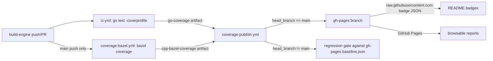

# Self-hosted coverage pipeline

This directory documents the BigQuery emulator's in-repo replacement
for [Codecov](https://about.codecov.io). The replacement publishes
the same artifacts (combined-suite badge, per-suite badges,
browsable HTML reports, regression-gated baseline) to the repo's
`gh-pages` branch instead of paying Codecov.

The implementation lives in:

- [`tools/coverage/`](../../../tools/coverage/) — Go aggregator
  (`summarize`, `badge`, `gate` subcommands; unit-tested against
  checked-in `coverage.out` and LCOV fixtures).
- [`taskfiles/coverage.yml`](../../../taskfiles/coverage.yml) —
  contributor-facing `task coverage:*` helpers that mirror CI.
- [`.github/workflows/coverage-publish.yml`](../../../.github/workflows/coverage-publish.yml)
  — `workflow_run` consumer that gates PRs and publishes to
  `gh-pages` on push-to-main.
- Producers: [`ci.yml`](../../../.github/workflows/ci.yml) (uploads
  `go-coverage`) and
  [`coverage-bazel.yml`](../../../.github/workflows/coverage-bazel.yml)
  (uploads `cpp-bazel-coverage`).

## Pipeline shape



On **pull requests**, `coverage-bazel` does not run; `coverage-publish` gates
on Go coverage only (the C++ row shows `skipped (missing data)`). On **push to
`main`**, `coverage-bazel` runs after `build-engine` succeeds and reuses the
warm `engine` Bazel disk cache.

## Operator runbook

The implementation lands in four commits; activities below are
manual one-time setup that the workflow itself cannot bootstrap.

### 1. (Optional) Pre-seed the `gh-pages` branch

`peaceiris/actions-gh-pages@v4` will create `gh-pages` on the first
successful push-to-main run, so this step is **optional**. Skip it
and you get a slightly nicer first PR (the regression gate has a
real baseline to compare against instead of running in bootstrap
mode). Pre-seeding also lets you enable GitHub Pages immediately,
before any main merge.

From a clean working tree:

```bash
git checkout --orphan gh-pages
git rm -rf .
cat > baseline.json <<'JSON'
{"total":0,"go":0,"cpp":0}
JSON
cat > index.html <<'HTML'
<!doctype html><meta http-equiv="refresh" content="0; url=summary.json">
HTML
git add baseline.json index.html
git commit -m "chore(coverage): bootstrap gh-pages baseline"
git push origin gh-pages
git checkout main
```

The zero-valued baseline means the gate has nothing to compare
against on the very first PR — every per-flag row reports
`skipped (missing data)` because the baseline's `go` and `cpp`
fields equal `0` and the current run's are real percentages
greater than zero. After the first push-to-main publish, the
baseline becomes accurate.

### 2. Enable GitHub Pages (for HTML reports and badge click-through)

Repo Settings → Pages → "Build and deployment":

- **Source:** GitHub Actions
- **Workflow:** `.github/workflows/pages.yml` (deploys after docs,
  coverage-publish, or bench publish to `gh-pages`; GITHUB_TOKEN pushes
  do not trigger other workflows on push)

After the first `gh-pages` push, GitHub serves the published `html/` tree
at `https://vantaboard.github.io/bigquery-emulator/` for browsable
Go/C++ coverage HTML and bench chart SVGs under `/bench/`.

README **badge images** do not depend on Pages: shields.io fetches
endpoint JSON from
`https://raw.githubusercontent.com/vantaboard/bigquery-emulator/gh-pages/badge*.json`
as soon as this workflow publishes to `gh-pages`. **Badge click-through**
links and the coverage index still use the `github.io` URLs above,
so enable Pages for those to work.

If the `gh-pages` branch does not exist yet (step 1 skipped),
Pages cannot be enabled until the first successful main-branch
publish creates it. Merge a no-op PR to `main`, wait for
`coverage-publish` to finish, then enable Pages.

### 3. Verify the pipeline end-to-end

**On a pull request:**

1. Open a no-op PR (whitespace edit is fine).
2. Wait for `ci` to complete (`coverage-bazel` does not run on PRs).
3. `coverage-publish` should fire from the `ci` producer and report a
   `Coverage gate` table in its run summary (Go rows gated; C++ row
   `skipped (missing data)`). The PR's "Checks" tab should show
   `coverage-publish / publish (ci)` as a passing check.
4. Merge to `main`.

**After merge to `main`:**

5. Wait for `build-engine`, then `coverage-bazel`, then `ci` to complete.
6. After the post-merge `coverage-publish` finishes (triggered by `ci`
   and/or `coverage-bazel`), the `gh-pages` branch should have:
   - `summary.json`, `baseline.json` (identical for this commit),
     `badge.json`, `badge-go.json`, `badge-cpp.json`
   - `go.html`, `cpp/index.html`, `index.html`
7. Confirm badge JSON is on `gh-pages`, then refresh the README on
   the main branch (allow ~5 minutes for shields.io's cache):

   ```bash
   curl -sf https://raw.githubusercontent.com/vantaboard/bigquery-emulator/gh-pages/badge.json | jq .
   ```

   The three `coverage*` badges should show real percentages, not
   `resource not found`.

### 4. Remove the `CODECOV_TOKEN` secret

Once steps 1-3 are green:

- Repo Settings → Secrets and Variables → Actions → Repository
  secrets → delete `CODECOV_TOKEN`.

No code change is required; nothing in the repo still references
that secret.

## Tuning the gate

`.github/workflows/coverage-publish.yml` exposes two env vars:

| Variable | Default | Meaning |
|----------|---------|---------|
| `COVERAGE_TOLERANCE` | `1.0` | Max allowed regression on the total/go/cpp fields, in percentage points. |
| `COVERAGE_FLOOR` | `0` | Absolute floor on the total field. `0` disables the floor check. |

To experiment locally before tightening, run:

```bash
task coverage:go
task coverage:summarize
task coverage:gate TOLERANCE=0.5 FLOOR=60
```

`task coverage:gate` fetches the latest `baseline.json` from
`origin/gh-pages` so the local check mirrors what the PR
workflow will compute.

## Why this design

- **gh-pages over a third-party SaaS** keeps the pipeline free and
  fully in this repo. No tokens to rotate, no quota to monitor.
- **Two artifacts, one consumer** keeps `ci.yml` and
  `coverage-bazel.yml` ignorant of badge layout / gate thresholds.
  Either producer can change without touching the publish workflow.
- **`workflow_run` trigger** lets the consumer run with `contents:
  write` even for PRs originating from forks, because
  `workflow_run`-triggered jobs execute in the *base* repo's
  context.
- **Each main publish overwrites** instead of accreting. Time-series
  trends are deliberately out of scope; the JSON summary contains
  enough data to bolt that on later if wanted.

## Troubleshooting

| Symptom | Cause | Fix |
|---------|-------|-----|
| Badge shows `resource not found` | `badge.json` absent on `gh-pages`, or publish step skipped | Confirm `coverage-publish` ran **Publish to gh-pages** on main; re-run the workflow if needed. Wait ~5 min for shields.io cache. |
| Badge shows `n/a` | Producer artifact missing for the published SHA | Re-run the failing producer; the next workflow_run will refresh the badge. |
| C++ badge/HTML shows `0.0%` / "summary only" | Bazel's in-test `llvm-profdata merge` fails on large profraw sets (LF:0/LH:0 combined report) | Ensure `.bazelrc` sets `LCOV_MERGER=/usr/bin/true` and `coverage-bazel` runs `tools/coverage/aggregate_profraw_lcov.sh` after `bazel coverage`. |
| Go badge `n/a` right after a main push | `coverage-bazel` published before `ci` finished (cpp-only partial) | Wait for the `ci`-triggered `coverage-publish` run, or check the deferral notice in the coverage-bazel publish logs. |
| Gate reports "Baseline missing" | `gh-pages` branch or its `baseline.json` not yet published | Wait for the first push-to-main publish, or pre-seed via step 1 above. |
| Gate fails on a PR you expected to pass | Current run dropped > `COVERAGE_TOLERANCE` percentage points | Inspect the step-summary table; either fix the regression or, if the threshold is wrong, tighten/relax `COVERAGE_TOLERANCE` in the workflow. |
| Pages 404 after enabling | `gh-pages` branch contents still in flight | Wait for the post-merge `coverage-publish` run to finish; GitHub serves the branch on a short delay. |
| README badges still cached on the old codecov badge | shields.io / browser cache | Hard-refresh; shields.io endpoint cache is ~5 min. |
